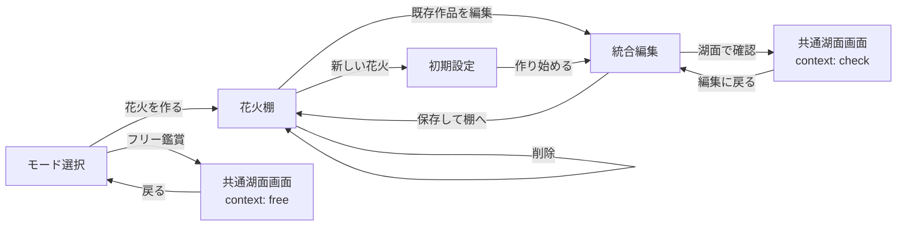
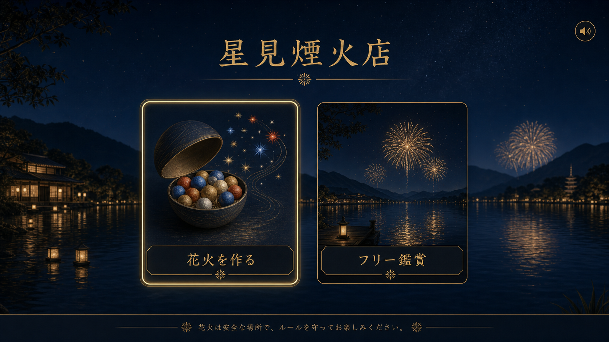
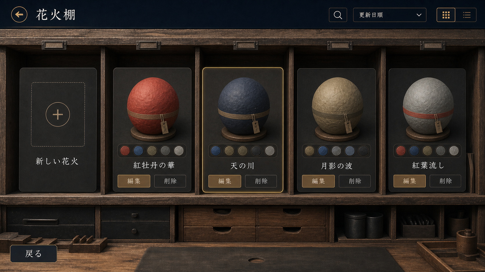
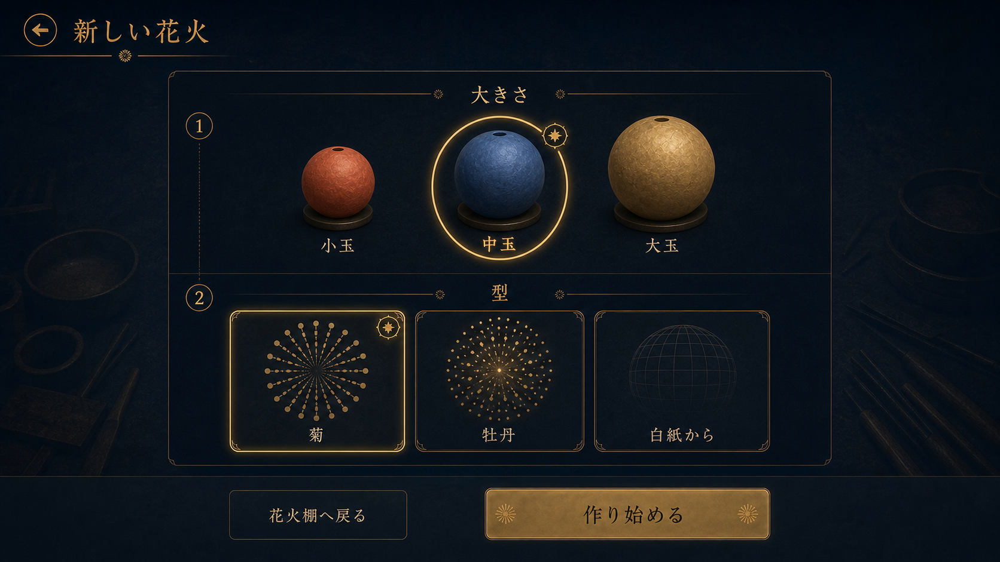
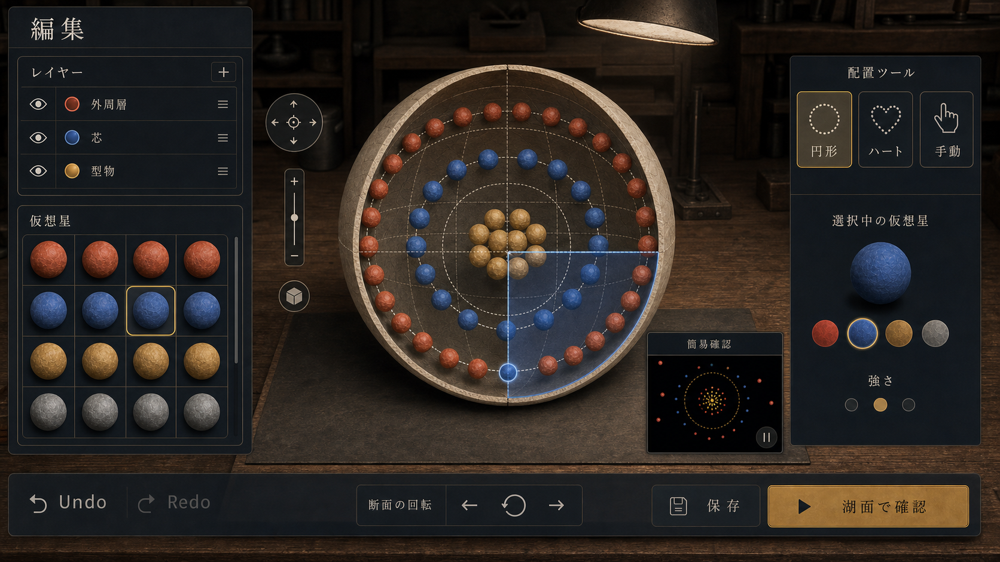
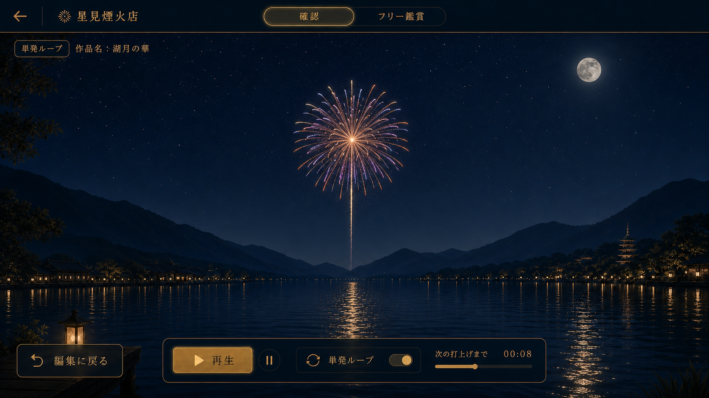

# 画面遷移・編集体験リニューアル 改修計画書

- 作成日: 2026-07-15
- ステータス: 実装中（Renewal Phase 3 完了）
- 基準資料: [RENEWAL_PLAN.md](RENEWAL_PLAN.md)
- 関連資料: [CRAFT_EDITOR_IMPLEMENTATION_PLAN.md](CRAFT_EDITOR_IMPLEMENTATION_PLAN.md)、[IMPLEMENTATION_PLAN.md](IMPLEMENTATION_PLAN.md)
- 対象: モード選択、作品棚、初期設定、製作エディター、確認、フリー鑑賞、保存データ

> 依頼文の `RENEAL_PLAN.md` は、リポジトリ内の `RENEWAL_PLAN.md` を指すものとして扱う。

## 1. 目的

現行の製作モードは内部配置エディターまで実装されている一方、アプリ起動直後から編集画面へ入る構成であり、「これから何をするか」「既存作品をどう扱うか」「制作中のどこにいるか」が1画面へ集まりすぎている。

本改修では、体験を次の5画面へ整理する。

1. モード選択
2. 花火棚（新規作成・既存編集・削除）
3. 新規作成の初期設定
4. 統合編集
5. 確認／フリー鑑賞の共通湖面画面

同時に、許容角度、発火タイミング、速度係数などの細かな値をユーザーが直接設定する方式をやめる。ユーザーが選ぶのは、仮想星の種類、玉内の位置、配置形状、玉の大きさといった視覚的な意図だけとし、実行用の値は決定的な導出処理で自動計算する。

完了時の状態は次のとおり。

- 起動直後に「花火を作る」「フリー鑑賞」の目的を迷わず選べる。
- 保存作品は、玉が並ぶ棚で新規作成・編集・削除できる。
- 新規作成時に決める項目は、玉の大きさと開始テンプレートだけである。
- 半球・断面図・型物の表示タブを廃止し、1つの常設ワークベンチで配置を編集できる。
- 制作工程ペインを廃止し、レイヤーと仮想星の領域を広く使える。
- 仮想星を長押しすると、その星単体の広がり方を小さなバルーンで確認できる。
- 編集画面内の小窓に、配置全体の概要を把握できる簡易確認アニメーションを表示する。
- `確認` とフリー鑑賞は同じ湖面画面を使い、確認では編集中の花火を単発ループ発射して実際の再生結果を確認できる。
- 花火棚と編集画面は実用的な工房として表現し、金の装飾は選択状態と主操作へ限定する。
- 既存v2作品を失わず、新しい自動導出モデルへ移行できる。

本機能は仮想花火の視覚デザインだけを扱う。実物の材料、配合、寸法、点火条件、製造手順はデータ、UI、ヘルプへ導入しない。

## 2. 現状と改修差分

| 領域 | 現在 | 改修後 |
| --- | --- | --- |
| 起動導線 | `AppShell` が製作画面を初期表示し、ヘッダーのタブで製作／フリーを切替 | 専用モード選択画面を入口にする |
| 作品管理 | 製作ワークスペース内に保存・読込・複製・削除が混在 | 花火棚へ集約し、新規／編集／削除の責務を分ける |
| 新規作成 | プリセット選択またはブランク開始が編集画面内にある | 大きさとテンプレートだけを選ぶ初期設定画面を挟む |
| 編集表示 | 半球組立・断面・型物配置・簡易確認をタブで切替 | 表示タブを廃止し、常時表示する1つの配置ワークベンチへ統合する |
| 左ペイン | 制作工程、レイヤー、部品皿が縦に並ぶ | 制作工程を削除し、レイヤーと部品皿へ全高を配分する |
| 詳細値 | `allowedAngle`、`ignitionOffset`、`radialSpeedScale` などをデザインが直接保持 | 星種・位置・配置意図から導出し、UIには露出しない |
| 簡易確認 | `DiagnosticView` が編集画面内の1表示として存在 | 編集画面内の常設小窓へ移し、抽象アニメーションで概要を示す |
| 再生確認 | 編集画面から直接単発打上 | `確認` 画面へ遷移し、湖面で同一作品を単発ループ再生する |
| 本番描画 | `FireworkSystem` が単発打上とフリー鑑賞を描画 | `確認` とフリー鑑賞で湖面・音・煙・反射を共用する |
| 保存 | `codex-starmine.designs.v2` | v2を残し、検証成功時だけv3を書き込む |

## 3. 設計原則

### 3.1 画面は目的単位で分ける

製作、作品管理、初期設定、編集、鑑賞を別の画面状態として扱う。DOMの `hidden` 切替だけで全機能を1クラスへ積み上げず、画面ごとに生成・破棄できるコンポーネントへ分ける。

### 3.2 ユーザーは意図を編集し、実行値は自動導出する

ユーザーが扱う値は次に限定する。

- 玉の大きさ
- 開始テンプレート
- 仮想星の種類
- レイヤー
- 緯度・経度の粗い区画と玉内の位置
- 円形、ハート、手動などの配置方法
- 星の追加、削除、置換、並替

許容角度、発火時刻、速度、重力、抗力、揺らぎ、寿命差は表示しない。仮想星プリセットと配置コンテキストから内部で導出する。

### 3.3 3種類の確認役割を分ける

- 仮想星の長押し: 星単体の抽象的な広がりだけを表示する。
- 簡易確認: 編集画面の小窓で、配置全体の色点と広がり目安を短くループ表示する。
- 確認: 湖面画面で、編集中の1作品を `FireworkSystem` により単発ループ発射する。
- フリー鑑賞: 同じ湖面画面で、複数作品による自動演目を再生する。

簡易確認用データは集約形式のままとし、編集操作を止めない軽量表示にする。実際の花火、音、煙、湖面反射を含む再生チェックは `確認` 画面へ明確に分離する。

### 3.4 工房としての視覚設計

- 花火棚は展示ケースではなく、木製の作業棚、ラベル差し、収納引出しを持つ工房として表現する。
- 編集画面は木製作業台と実用的なパネルを基調にする。
- 金色は選択、フォーカス、主ボタンだけに使う。
- 花柄、波柄、飾り罫、ロゼット、過剰な発光や蒔絵風の装飾は使わない。
- 作品カードの玉は無地または細い帯を持つ和紙調とし、識別は色、名前、小さなタグで行う。

### 3.5 破壊操作は棚で完結させる

削除は花火棚だけで提供し、確認ダイアログを必須にする。編集中の誤操作で作品を削除できないようにする。

### 3.6 PCとモバイルで情報階層を変えない

デスクトップでは左右ペイン、モバイルではドロワーを使うが、操作名と遷移は共通にする。390 × 844でも新規作成、星配置、小窓の簡易確認、湖面での確認、保存まで横スクロールなしで完了できることを条件とする。

## 4. 画面遷移



画面状態は履歴を追いやすい判別共用体にする。

```ts
type AppScreen =
  | { kind: "mode-select" }
  | { kind: "library"; selectedDesignId?: string }
  | { kind: "initial-setup"; draft: InitialSetupDraft }
  | { kind: "editor"; designId: string; origin: "new" | "saved" }
  | { kind: "viewer"; context: "check" | "free"; designId?: string };
```

ブラウザ再読込では `mode-select` を安全な既定値とする。編集中の未保存内容がある場合だけ、画面離脱前に確認する。

## 5. 画面仕様

### 5.1 モード選択



目的は、起動直後の選択肢を2つに絞ることである。

| 項目 | 仕様 |
| --- | --- |
| 主操作 | `花火を作る`、`フリー鑑賞` |
| 補助操作 | 音の有効／無効、簡潔な安全表記 |
| 初期フォーカス | `花火を作る` |
| 遷移 | 花火棚、または共通湖面画面のfreeコンテキスト |
| モバイル | 2カードを縦積みにする |

背景は湖畔夜景を使うが、操作カードのコントラストを優先する。現行ヘッダーのモードタブはこの画面へ置き換える。

### 5.2 花火棚



保存作品を「玉」として一覧化する。カードの主操作は編集であり、削除は常に副操作とする。

| 状態 | 表示と操作 |
| --- | --- |
| 通常 | 新規カード、保存作品カード、更新順／名前順、検索 |
| 選択 | 対象カードを金枠で強調し、編集・削除を明示 |
| 削除確認 | 作品名、取消、削除確定をモーダル表示 |
| 空 | 新規作成カードと説明だけを表示 |
| 読込失敗 | 保存データを変更せず、再試行と安全な戻り先を表示 |

カードサムネイルには再生結果の静止画を使わず、玉の外装または抽象化した内部配置を使う。実際の再生結果は専用の `確認` 画面で見るものとし、棚は作品の識別と管理に集中させる。

画面全体は木製の作業棚と収納引出しが見える工房として構成する。作品カードの玉は無地の和紙調と細い識別帯を基本とし、展示品のような花柄、風景柄、金の飾り罫、強い発光は使わない。

### 5.3 新規作成の初期設定



新規作品の開始条件だけを決める。入力項目を増やさない。

| 項目 | 選択肢 |
| --- | --- |
| 大きさ | 小玉、中玉、大玉。内部値は既存 `small`、`medium`、`large` を継続利用 |
| 型 | 菊、牡丹、白紙から。後続で必要なテンプレートを追加可能なカード構造 |
| 確定 | `作り始める` で一時draftを作り、統合編集へ遷移 |
| 取消 | `花火棚へ戻る`。未保存作品は作らない |

プリセットから作る場合も白紙から作る場合も、同じv3編集ドキュメントへ変換する。初期設定画面から許容角度や発火タイミングは設定できない。

### 5.4 統合編集



半球・断面図・型物の表示タブは設けない。玉内配置、粗い区画ガイド、円形・ハート配置を1つの常設ワークベンチ上へ重ね、表示を切り替えなくても同じ座標を直接編集できるようにする。

#### レイアウト

| 領域 | 内容 |
| --- | --- |
| 左上 | 全高を使ったレイヤー一覧。表示、ロック、並替、選択 |
| 左下 | 仮想星の部品皿。色と効果で分類し、ドラッグまたはキーボードで配置 |
| 中央 | 玉皮の切り開き、粗い区画ガイド、配置点群を常時重ねる単一ワークベンチ |
| 右 | 選択中の星と配置ツール。円形、ハート、手動など意図レベルの操作だけを表示 |
| 右下 | 配置全体を抽象アニメーションで示す小窓の簡易確認 |
| 下 | Undo/Redo、配置面の回転、保存、`湖面で確認` |

制作工程ペインは削除する。現在位置は画面遷移そのものと見出しで分かるため、編集画面内の工程番号は持たない。

#### 緯度・経度による配置面

- 玉内座標は半径1の正規化座標だけを扱う。
- 緯度と経度はそれぞれ4区画を初期値とする。
- ポインターで区画を選ぶと、該当する配置面と配置候補を強調する。
- 区画数は将来変更できる内部設定とし、実寸や実物の製造寸法へ結び付けない。
- 配置面を回しても、仮想星の保存座標は同じ正規化座標系に残る。

#### 便利な配置

- 円形: 選択中の配置面へ等間隔の仮想星を置く。
- ハート: 正規化済みの組込み点群を選択中の配置面へ置く。
- 手動: 1点ずつ追加、移動、削除する。
- 配置後は通常の点群として扱い、個別に星種を置換できる。

#### 仮想星の長押し確認

- `pointerdown` から450msでバルーンを開く。
- 8pxを超えて移動した場合はドラッグとして扱い、長押しを取り消す。
- バルーンは星プリセット単体の色順、広がり目安、尾の有無だけを抽象表示する。
- `Escape`、ポインター解放、他要素選択で閉じる。
- キーボードでは部品にフォーカスして `Space` または専用の `広がりを見る` 操作で同じ内容を開く。
- バルーンは `FireworkSystem` を呼び出さない。

#### 編集画面内の簡易確認

- 編集画面の右下または中央下へ常設する小窓とする。
- 現在の全レイヤーを、色点、簡単な拡大リング、発火順の短いループとして表示する。
- 星や配置を変更した後、150msのデバウンスを置いて自動更新する。
- 再生、一時停止、先頭へ戻るだけを提供し、速度や物理値の編集は行わない。
- 小窓は `ApproximateSpreadModel` と軽量な2D描画だけを使い、湖面、音、煙、`FireworkSystem` は使わない。
- 詳細な再生結果を見たい場合は、下部の `湖面で確認` から確認画面へ遷移する。

### 5.5 確認／フリー鑑賞の共通湖面画面



湖面、夜景、戻る操作、音、再生コントロールは共通化する。単発ループによる再生チェックと自動演目をコンテキスト別のコントローラーで切り替える。

| 項目 | checkコンテキスト | freeコンテキスト |
| --- | --- | --- |
| 入口 | 統合編集の `湖面で確認` | モード選択の `フリー鑑賞` |
| 描画 | 編集中の1作品による実際の単発打上、煙、音、湖面反射 | 複数作品による実際の自動演目、煙、音、湖面反射 |
| データ | 編集中の `FireworkDesign` と固定check seedによる `CompiledBurstPlan` | `ShowPlan` とcueごとの `CompiledBurstPlan` |
| 再生 | 1発ずつ一定間隔で繰り返す単発ループ | 自動演目の連続再生 |
| 操作 | 再生／停止、ループ切替、次の打上までの表示 | 再生／停止、演出密度、視点操作 |
| 戻り先 | 編集画面 | モード選択 |
| 発射制約 | 1周期につき1発だけ。複数作品やスターマインを混ぜない | 現行フリー鑑賞を継承 |

`ViewingStage` は共通UIと湖面シーンを所有し、`SingleLoopCheckController` と既存の `FreeShowController` を切り替える。checkでは同じ作品とcheck seedを使って比較しやすい再生を行い、ループを再開しても結果を変えない。画面離脱時には待機中の発射を必ず破棄し、free側のcueと同時実行しない。

## 6. 自動パラメーター導出

### 6.1 入力と出力

自動導出は、保存された制作意図だけを入力にする。

```text
VirtualStarPreset
  + layer kind
  + normalized position (radius / latitude / longitude)
  + placement template / local density
  + size class
  + assembly seed
  + derivation version
      ↓ deriveVirtualBehavior()
DerivedVirtualBehavior
  ignitionOffset
  radialSpeedScale
  orientation policy
  spread envelope
  gravity / drag / lifetime modifiers
  child delay / wave delay
```

| 現在の値 | 改修後の決定要素 | UIでの直接編集 |
| --- | --- | --- |
| `LayerBase.ignitionOffset` | レイヤー種別、星種、中心からの正規化距離 | なし |
| `LayerBase.radialSpeedScale` | 玉サイズ、レイヤー半径、配置テンプレート | なし |
| `PatternStarLayer.allowedAngle` | 型物テンプレートと向きポリシー | なし |
| `orientationDegrees` / `rotationJitter` | 選択配置面、会場向き、assembly seed | なし |
| `BurstField.gravityScale` / `drag` | 仮想星プリセットと玉サイズ | なし |
| `ChildBurstLayer.delay` / `waveDelay` | 子花星種、配置順、正規化距離 | なし |
| `LaunchVariation` | 星種別の許容範囲とlaunch seed | なし |

### 6.2 決定性

- 同じデザイン、`derivationVersion`、assembly seedから同じ導出値を得る。
- Undo/Redo、保存、再読込で結果が変わらない。
- launch seedは完成打上の小さな揺らぎにだけ使い、編集時の導出値には混ぜない。
- 導出式を変更するときは `derivationVersion` を上げ、旧作品の結果を再現できるようにする。

### 6.3 v3保存形式

`FireworkDesignV3` は、ユーザーが編集する意図と互換情報を分ける。

```ts
interface FireworkDesignV3 {
  schemaVersion: 3;
  derivationVersion: 1;
  sizeClass: SizeClass;
  starDefinitions: Record<string, VirtualStarPreset>;
  layers: IntentLayer[];
  assemblySeed: number;
  legacyBehavior?: LegacyBehaviorSnapshot;
}
```

移行手順:

1. `codex-starmine.designs.v3` があれば検証して読む。
2. v3がなくv2があれば、全作品をメモリ上で変換する。
3. 既存の細かな値は `legacyBehavior` へ保存し、移行直後の完成打上を回帰比較できるようにする。
4. 全件の型検証と固定seed回帰に合格した場合だけv3へ書く。
5. `codex-starmine.designs.v2` は削除しない。
6. 1件でも失敗した場合はv3を書かず、v2読込へ戻して警告する。

新規作品は最初から導出モデルを使う。移行作品もUIでは細かな値を表示せず、星種や配置を変更した範囲からv3導出値へ置き換える。

## 7. アーキテクチャ

### 7.1 責務分割

```text
NightSkyApp
  ├─ AppFlowController
  │    └─ AppScreen + back navigation + dirty guard
  ├─ RenewalAppShell
  │    └─ active Screen component
  ├─ CraftDocumentStore
  │    └─ design intent + selection + history
  ├─ deriveVirtualBehavior()
  │    └─ deterministic runtime parameters
  ├─ InlineDiagnosticPreview
  │    └─ ApproximateSpreadRenderer  editor small window
  ├─ ViewingStage
  │    ├─ SingleLoopCheckController + FireworkSystem
  │    └─ FreeShowController + FireworkSystem
  └─ DesignRepository
       └─ v3 read/write + v2 fallback
```

`NightSkyApp` はレンダリングと各コントローラーの組立に限定する。現在 `AppShell` と `CraftWorkspace` に集中している画面遷移、作品管理、表示切替を専用クラスへ移す。

### 7.2 予定ファイル

| ファイル | 変更内容 |
| --- | --- |
| `src/ui/AppShell.ts` | 共通シェルへ縮小するか `RenewalAppShell` へ置換 |
| `src/app/AppFlowController.ts` | 5画面の状態遷移、戻る、未保存ガード |
| `src/ui/screens/ModeSelectionScreen.ts` | モード選択 |
| `src/ui/screens/FireworkShelfScreen.ts` | 一覧、新規、編集、削除確認 |
| `src/ui/screens/InitialSetupScreen.ts` | 大きさとテンプレート選択 |
| `src/ui/craft/IntegratedCraftEditor.ts` | 統合編集画面 |
| `src/ui/craft/LayerPanel.ts` | 拡張レイヤーペイン |
| `src/ui/craft/StarLibraryPanel.ts` | 部品皿と長押しバルーン |
| `src/ui/craft/IntegratedPlacementWorkbench.ts` | 表示タブを持たない単一座標ワークベンチ |
| `src/ui/craft/InlineDiagnosticPreview.ts` | 編集画面内の小窓による簡易確認 |
| `src/ui/viewer/ViewingStage.ts` | check/free共通湖面画面シェル |
| `src/modes/check/SingleLoopCheckController.ts` | 同一作品を1発ずつ繰り返す確認再生 |
| `src/render/preview/ApproximateSpreadRenderer.ts` | 小窓用の軽量な抽象アニメーション |
| `src/core/burst/deriveVirtualBehavior.ts` | 星種・位置からの決定的導出 |
| `src/data/firework.ts` | v3意図モデル、v2互換型 |
| `src/data/migrations/v2ToV3.ts` | 非破壊移行 |
| `src/data/storage.ts` | v3優先、v2フォールバック |
| `src/render/NightSkyApp.ts` | 新しいフローとviewer adapterの組立 |
| `src/style.css` | 画面別レイアウト、モバイルドロワー、フォーカス状態 |

## 8. フェーズ計画

### Renewal Phase 0: 契約固定と回帰基準（完了: 2026-07-15）

- [x] 現行6プリセットと保存作品fixtureを固定seedで保存する。
- [x] 現行の製作、保存、読込、削除、確定打上、フリー鑑賞の回帰テストを追加する。
- [x] `FireworkDesignV2` とストレージv2を読み取り専用の互換契約として固定する。
- [x] 5画面の遷移表と、簡易確認／確認／フリー鑑賞の責務分離をテスト項目へ落とす。

完了基準: リニューアル前の作品と打上結果を比較できる自動fixtureがある。

**完了確認**:

- `src/test/fixtures/renewalBaseline.ts` に固定seed `424242` の6プリセット、v2保存作品、フリー演目の基準ハッシュと粒子集計を保存した。
- `src/test/renewalBaseline.test.ts` でプリセット、`CompiledBurstPlan`、v2保存・再読込、フリー演目を比較可能にした。
- `src/modes/craft/CraftController.test.ts` と `src/modes/viewFree/FreeShowController.test.ts` で現行の製作、保存、読込、削除、完成打上、フリー鑑賞の操作回帰を固定した。
- `src/app/renewalContracts.ts` に5画面とviewerの2コンテキストの遷移表、未保存ガード、抽象確認と本番描画の責務表を定義した。
- `rtk npm run lint`、`rtk npm run test:run`（16ファイル、50件成功）、`rtk npm run build` が成功した。production buildには既存の550 kB超chunk警告が残る。

### Renewal Phase 1: 画面状態と共通シェル（完了: 2026-07-15）

- [x] `AppFlowController` と `AppScreen` を実装する。
- [x] モード選択画面を実装する。
- [x] 画面ごとのmount/unmountと戻る操作を実装する。
- [x] 未保存編集の離脱ガードを実装する。
- [x] 現行モードタブを新しい入口へ置き換える。

完了基準: モード選択から仮の花火棚とfreeコンテキストへ遷移し、戻る操作が一貫する。

**完了確認**:

- `src/app/AppFlowController.ts` に判別共用体 `AppScreen`、契約表に基づく遷移、不正遷移の拒否、戻る操作、未保存離脱ガード、checkから同一editorへ戻る履歴を実装した。
- `src/ui/screens/ModeSelectionScreen.ts` と `src/ui/screens/FireworkShelfScreen.ts` を追加し、起動時の2目的選択と、現行制作ドキュメントを安全に開ける暫定花火棚を実装した。
- `src/ui/AppShell.ts` を画面単位のmount/unmount構成へ変更し、既存製作画面とフリー鑑賞を新しいフローへ接続した。旧モードタブは削除し、各画面の戻る操作へ置き換えた。
- 制作ドキュメントの `dirty` 状態をフローへ接続し、花火棚へ戻るときの確認とブラウザ再読込時の `beforeunload` ガードを実装した。
- 1280 × 720と390 × 844でモード選択、花火棚、既存工房、フリー鑑賞、戻る操作を実ブラウザ確認した。390px幅では `scrollWidth = innerWidth = 390`、ブラウザコンソールのwarning/errorは0件だった。
- `rtk npm run lint`、`rtk npm run test:run`（17ファイル、55件成功）、`rtk npm run build`、変更ファイルのPrettier確認が成功した。production buildには既存の550 kB超chunk警告が残る。

### Renewal Phase 2: 花火棚と初期設定（完了: 2026-07-15）

- [x] 保存作品のカード一覧、検索、並替、空状態を実装する。
- [x] 新規、編集、削除確認を花火棚へ集約する。
- [x] 大きさと菊／牡丹／白紙を選ぶ初期設定画面を実装する。
- [x] 初期設定から一時draftを作り、取消時には保存しない。
- [x] 玉外装／断面の抽象サムネイル生成を実装する。
- [x] 木製作業棚、ラベル差し、収納引出しを持つ簡素な工房スタイルを実装する。

完了基準: 新規作成と既存編集が別導線で同じ編集ドキュメントへ到達し、削除取消も機能する。

**完了確認**:

- `src/ui/screens/FireworkShelfScreen.ts` に新規カード、保存作品カード、名前検索、更新順／名前順、空状態、選択状態、削除確認ダイアログを実装した。更新順はv2保存形式を変更せず、最後に保存した作品をリポジトリ配列の先頭へ移すことで表現する。
- 棚のカードへ、作品の可視レイヤーとテーマ色から作る軽量な玉外装／断面サムネイルを実装した。完成打上の描画や `FireworkSystem` は使用していない。
- `src/ui/screens/InitialSetupScreen.ts` に小玉／中玉／大玉と菊／牡丹／白紙だけを選ぶ画面を追加した。取消時は制作ドキュメントと保存領域を変更せず、`作り始める` 時だけ未保存の `draft-new` を生成する。
- `CraftWorkspace` から保存作品の読込、複製、削除、一から作る操作を撤去し、新規、既存編集、削除を花火棚へ集約した。
- `src/style.css` に木製作業棚、ラベル付き検索／並替、収納引出し、和紙調の玉、初期設定カードを追加し、金色を選択と主操作へ限定した。
- 実ブラウザで検索、名前順、削除取消、新規の大玉＋白紙draft、保存後の更新順先頭、確認用作品の削除確定、既存作品編集を確認した。確認用作品は検証後に削除し、既存2作品が保持されることを確認した。
- 1280 × 720と390 × 844で花火棚と初期設定を確認し、両方で `scrollWidth = innerWidth`、ブラウザコンソールのwarning/errorは0件だった。
- `rtk npm run lint`、`rtk npm run test:run`（18ファイル、62件成功）、`rtk npm run build`、変更ファイルのPrettier確認が成功した。production buildには既存の550 kB超chunk警告が残る。

### Renewal Phase 3: 自動導出モデルとv3移行

- [x] `deriveVirtualBehavior` の入力・出力契約を固定する。
- [x] 星種、正規化位置、配置方法、玉サイズから実行値を決定する。
- [x] 低レベル値の直接編集UIを削除する。
- [x] v2→v3の非破壊移行を実装する。
- [x] `derivationVersion` と旧結果比較を実装する。
- [x] コンパイラをv3意図モデル + 導出結果から動作させる。

完了基準: 同じ入力から同じ導出結果を得られ、既存作品を失わず保存・再読込できる。

**完了確認**:

- `src/core/burst/deriveVirtualBehavior.ts` に `derivationVersion: 1` の入力・出力契約を実装した。星種、レイヤー種別、正規化位置、配置方法、局所密度、玉サイズ、assembly seedだけから、基準速度、発火順、速度・位置・寿命の揺らぎ、重力、抗力、型物の向き、子花の時間差、簡易確認用の広がり包絡を決定的に導出する。
- `src/core/burst/compiler.ts` はv2作品だけ旧値を読み、v3作品では `ignitionOffset`、`radialSpeedScale`、`allowedAngle`、`orientationDegrees`、`rotationJitter`、`delay`、`waveDelay`、`burstField.baseVelocity`、`launchVariation`、`realism` の互換shadowを実行値として使わない構成へ変更した。仮想星の重力と抗力も導出結果を使う。
- `src/data/firework.ts` に `FireworkDesignV3`、`IntentLayer`、`LegacyBehaviorSnapshot`、厳格なv3型検証を追加した。Phase 4でワークベンチを置換するまで既存レンダラーが必要とする低レベルフィールドは互換shadowとして保持するが、編集UIとv3コンパイラからは切り離した。
- `src/data/migrations/v2ToV3.ts` と `src/data/storage.ts` にv2→v3の全件移行を追加した。v3を優先して読み、v3がなければv2をメモリ上で変換し、型検証と固定seed `424242` の旧結果比較に全件成功した場合だけ `codex-starmine.designs.v3` へ書く。v2キーは削除せず、破損した1件またはv3検証失敗時はv3を書かずv2へフォールバックする。
- `CraftController` は新規draftを編集開始時からv3へ変換する。`CraftWorkspace` から本番の揺らぎ、欠け率、発火タイミング、許容角度、正面角度、回転揺らぎ、子花の発火遅延・波状時間差、星の寿命・輝度・尾・点滅・重力・抗力の直接編集を撤去し、自動調整の説明へ置き換えた。
- 実ブラウザで新規の菊draftと型物レイヤーを開き、削除対象の低レベル設定コントロールが0件、自動調整説明が表示されること、1280px幅で `scrollWidth = innerWidth = 1280`、ブラウザコンソールのwarning/errorが0件であることを確認した。
- `rtk npm run lint`、`rtk npm run test:run`（20ファイル、73件成功）、`rtk npm run build`、変更ファイルのPrettier確認が成功した。production buildには既存の550 kB超chunk警告が残る。

### Renewal Phase 4: 統合編集ワークベンチ

- [ ] 制作工程ペインを削除し、レイヤーと部品皿を拡張する。
- [ ] 半球・断面図・型物の表示タブを削除する。
- [ ] 玉皮、配置面、点群を同じ正規化座標の常設ワークベンチへ統合する。
- [ ] 緯度・経度の4区画選択と配置面の回転を実装する。
- [ ] 円形、ハート、手動配置を実装する。
- [ ] 仮想星の長押しバルーンとキーボード代替操作を実装する。
- [ ] 編集画面内へ小窓の簡易確認を実装する。
- [ ] ドラッグ操作を1件のUndo履歴へまとめる。
- [ ] デスクトップとモバイルドロワーを実装する。
- [ ] 工房の木製作業台、実用パネル、限定的な金色アクセントへスタイルを整理する。

完了基準: 表示タブなしで星を配置面へ置き、便利配置を個別編集し、小窓の簡易確認、Undo/Redo、保存ができる。

### Renewal Phase 5: 共通湖面画面

- [ ] `ViewingStage` とcheck/free controllerを実装する。
- [ ] `SingleLoopCheckController` で同一作品を1周期1発だけ発射する。
- [ ] check seed、ループ間隔、再生／停止、次回発射までの表示を実装する。
- [ ] checkでも湖面、音、煙、反射を含む実際の `FireworkSystem` 再生を行う。
- [ ] 既存フリー鑑賞、密度、停止、視点操作をfree controllerへ移す。
- [ ] checkとfreeの待機cueを排他的に破棄する。
- [ ] context別の戻り先、ラベル、再生操作を実装する。

完了基準: 1つの湖面画面でcheckとfreeを切り替えられ、checkでは編集中の1作品だけが一定間隔で単発ループ再生される。

### Renewal Phase 6: 仕上げと受け入れ

- [ ] 1280 × 720、1024 × 768、390 × 844で全フローを確認する。
- [ ] キーボード、フォーカス順、スクリーンリーダー名、動きの軽減設定を確認する。
- [ ] 高負荷作品でも長押しバルーンと編集内の簡易確認が本番粒子数に依存しないことを確認する。
- [ ] lint、単体テスト、production buildを通す。
- [ ] 既存6プリセット、v2保存作品、フリー鑑賞、完成打上を回帰確認する。
- [ ] [IMPLEMENTATION_PLAN.md](IMPLEMENTATION_PLAN.md) とREADMEの操作説明を更新する。

完了基準: 受け入れ基準を全件確認し、旧保存データを保持したままリニューアル版を通常起動できる。

## 9. テスト計画

### 9.1 単体テスト

- `AppFlowController`: 正常遷移、戻る、未保存ガード、不正状態の安全な復帰。
- `deriveVirtualBehavior`: 決定性、位置境界、星種差、サイズ差、derivation version。
- `v2ToV3`: 全プリセット、空ライブラリ、壊れた1件、v2キー保持。
- `IntegratedPlacementWorkbench`: 座標変換、4区画境界、配置面回転、便利配置の点数、Undo単位、表示タブが存在しないこと。
- 長押し: 450ms成立、移動取消、pointercancel、キーボード操作。
- `ApproximateSpreadModel`: 小窓用の集約結果だけを返し、本番星座標を公開しない。
- `SingleLoopCheckController`: 1周期1発、停止時の予約破棄、固定check seed、ループ間隔、free cueとの排他。

### 9.2 結合テスト

1. モード選択 → 花火棚 → 初期設定 → 編集 → 小窓の簡易確認 → 湖面で確認 → 編集 → 保存 → 花火棚。
2. 花火棚 → 既存作品編集 → 保存 → 再読込。
3. 花火棚 → 削除 → 取消、および削除確定。
4. モード選択 → フリー鑑賞 → 停止／再開 → 視点変更 → 戻る。
5. v2のみ存在する状態 → v3移行 → 再読込 → v2キー残存。

### 9.3 目視確認

- 画面間で見出し、戻る位置、主ボタン位置が一貫している。
- 金色の選択状態とキーボードフォーカスを色以外でも判別できる。
- 390px幅で横スクロールが発生しない。
- 編集画面内の簡易確認は小窓の抽象表示であり、編集操作と同時に概要を把握できる。
- `確認` はフリー鑑賞と同じ湖面画面を使い、編集中の1作品だけを単発ループ再生する。
- フリー鑑賞では現行の湖面、煙、音、自由視点が維持される。
- 花火棚と編集画面は実用的な工房に見え、装飾が選択や操作の判別を妨げない。
- ブラウザコンソールにエラーがない。

## 10. 受け入れ基準

- [x] 起動時にモード選択が表示される。
- [x] 「花火を作る」から花火棚へ遷移する。
- [x] 花火棚で新規、編集、削除、削除取消ができる。
- [x] 新規作成の設定項目は大きさとテンプレートだけである。
- [ ] 編集画面に制作工程ペインが存在しない。
- [ ] レイヤーと部品皿が旧レイアウトより広い。
- [ ] 半球・断面図・型物の表示タブが存在しない。
- [ ] 緯度・経度の粗い区画から配置面を選び、星を配置できる。
- [ ] 円形、ハート、手動の配置を使える。
- [ ] 仮想星の長押しとキーボード操作で抽象プレビューを開ける。
- [ ] 編集画面内の小窓で配置全体の簡易確認アニメーションを再生できる。
- [x] 許容角度、発火タイミング、速度、重力、抗力を手動設定するUIがない。
- [x] 星種と位置から同じ実行値を再現可能に導出する。
- [ ] `確認` とフリー鑑賞が同じ湖面画面シェルを使う。
- [ ] `確認` では編集中の1作品だけが単発ループ発射される。
- [ ] checkとfreeの発射予約が同時に残らない。
- [x] 花火棚と編集画面が工房を基調とし、過剰な飾り罫、柄、発光を使わない。
- [x] v2作品を失わずv3へ移行し、v2キーが残る。
- [x] 既存6プリセット、完成打上、フリー鑑賞が回帰しない。
- [x] `npm run lint`、`npm run test:run`、`npm run build` が成功する。

## 11. リスクと対策

| リスク | 影響 | 対策 |
| --- | --- | --- |
| 自動導出で旧作品の見た目が変わる | 保存作品への信頼を失う | `derivationVersion`、legacy snapshot、固定seed比較、v2キー保持 |
| 編集内の簡易確認が重くなる | 配置操作が途切れる | 集約モデルと2D小窓に限定し、`FireworkSystem` を使わない |
| checkとfreeが同時発射する | 確認中に別作品が混ざる | controller切替時に全予約cueを破棄し、所有権を排他にする |
| 統合ワークベンチが複雑になる | 配置面と玉内位置の対応が分かりにくい | 同じ正規化座標、選択区画の強調、常設ガイド |
| 長押しとドラッグが競合する | 意図しないバルーンや配置が起きる | 時間閾値、移動閾値、pointer capture、キーボード代替 |
| 工房表現が装飾過多へ戻る | 操作階層が埋もれる | 金色の用途を選択・フォーカス・主ボタンへ限定する |
| モバイルで左右ペインが狭い | 配置操作が困難 | ドロワー化、中央優先、主操作の下部固定 |
| 既存未コミット実装との競合 | 作業中の変更を失う | Phaseごとに現行差分を再確認し、ファイル単位で小さく移行する |

## 12. 今回の対象外

- 実物の花火製造を再現するパラメーターや説明
- 新しい花火種類、音響方式、煙表現、湖面表現の追加
- ミュージック連動モードの実装
- クラウド同期、共有、共同編集
- SVG／画像ファイルの型物インポート
- 完成打上のレンダリング品質そのものの刷新

## 13. 画像生成仕様

画面イメージは組込みの `imagegen` を使用して生成・修正した。既存の [Phase 6.5画面イメージ](images/phase-6-5-internal-layout-editor-v2.png) を出発点にしつつ、花火棚と編集画面は工房として再編集し、金色と装飾を大幅に抑えた。全画像は1672 × 941のPNGである。再生成用の完全なプロンプトは [Renewal UI mockup prompt set](images/renewal/PROMPTS.md) に保存した。

共通プロンプト要件:

```text
Use case: ui-mockup / precise-object-edit
Style: polished shippable desktop game UI, understated workshop utility
Palette: charcoal navy, natural wood, warm gray, muted paper colors,
limited antique gold for selection and primary actions only
Constraints: practical layout; no real materials, chemistry, measurements,
manufacturing instructions, excessive decoration, trademarks, or watermark;
avoid tiny dense text
```

| 画像 | 最終プロンプトの主要求 |
| --- | --- |
| `01-mode-selection.png` | 「星見煙火店」の入口。`花火を作る` と `フリー鑑賞` の2枚だけを大きく表示する |
| `02-firework-shelf.png` | 簡素な工房の作業棚で `新しい花火`、`編集`、`削除` を扱い、削除を副操作にする |
| `03-initial-setup.png` | `小玉`、`中玉`、`大玉` と `菊`、`牡丹`、`白紙から` だけを選ぶ |
| `04-integrated-editor.png` | 表示タブを廃止し、拡張レイヤー、部品皿、常設配置面、小窓の簡易確認を工房の1画面へ統合する |
| `05-shared-viewer.png` | `確認` と `フリー鑑賞` の共通湖面画面。確認では1作品を単発ループ発射する |

画像は画面構成と視覚階層の合意形成用であり、画像内の細かな数値や装飾をそのまま実装要件とはしない。実装時は本書の画面仕様、アクセシビリティ、レスポンシブ条件を優先する。
