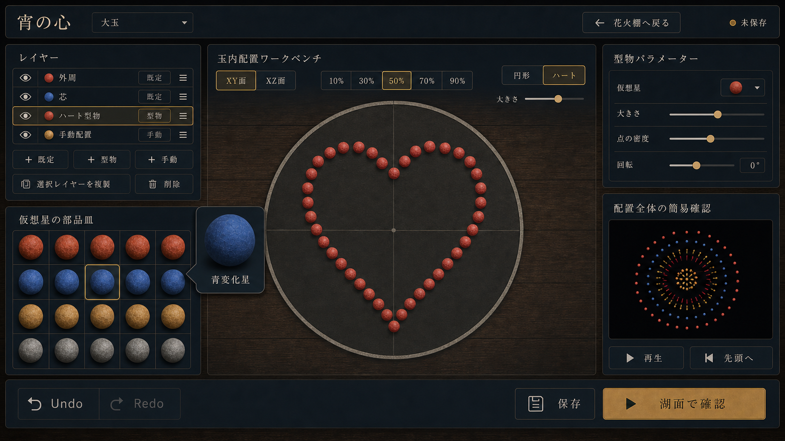

# 編集体験リニューアル2 改修計画書

- 作成日: 2026-07-16
- ステータス: Renewal2 Phase 2 完了・Phase 3 着手前
- 基準資料: [RENEWAL_PLAN2.md](RENEWAL_PLAN2.md)
- 先行計画: [RENEWAL_IMPLEMENTATION_PLAN.md](RENEWAL_IMPLEMENTATION_PLAN.md)
- 関連資料: [CRAFT_EDITOR_IMPLEMENTATION_PLAN.md](CRAFT_EDITOR_IMPLEMENTATION_PLAN.md)、[RESEARCH.md](RESEARCH.md)
- 対象: タイトル画面、共通ヘッダー、レイヤー、仮想星の部品皿、玉内配置ワークベンチ、配置全体の簡易確認、保存データ



## 1. 目的

先行リニューアルでは、画面遷移、花火棚、初期設定、統合編集、確認／フリー鑑賞の分離まで完了した。一方、現在の統合編集には次の問題が残っている。

- タイトル画面が静的で、実際の花火鑑賞体験を入口で伝えられていない。
- 全画面に表示する「星見煙火店」と、画面固有の作品情報が競合している。
- 仮想星の長押しバルーンが部品皿のスクロール領域で欠ける場合がある。
- 作品名と玉の大きさが右ペインにあり、編集対象を常時確認しにくい。
- レイヤーの複製・削除が右ペインにあり、対象の一覧と操作場所が離れている。
- レイヤー種別と編集方法の境界が曖昧で、既定配置や型物の点も個別操作できてしまう。
- 現行ワークベンチは緯度・経度区画と球面投影を使うため、2次元の型物や手動配置を意図どおり扱いにくい。
- ハート点群を球面へ投影した結果、正面から見てもハートと認識しにくい場合がある。
- 右ペインの内容が縦に伸び、配置全体の簡易確認がスクロールなしでは見えない場合がある。

本改修では、タイトルを実際のフリー鑑賞デモへ接続し、編集画面を「レイヤーを選ぶ」「断面を選ぶ」「断面上へ配置する」「全体を確認する」という一貫した流れに再構成する。

完了時の状態は次のとおり。

1. タイトル背景で花火が自動再生され、カメラが複数の安全な視点をゆっくり巡回する。
2. 「星見煙火店」と「今夜は、何をしますか」を削除しても、2つの主操作が明確に判別できる。
3. 編集中の作品名と玉の大きさを画面上部で常時確認・変更できる。
4. レイヤーの追加、選択、並替、複製、削除をレイヤーペイン内で完結できる。
5. レイヤーを `既定`、`型物`、`手動` の編集方式で複数作成できる。
6. `既定` と `型物` はパラメーター編集だけを許可し、仮想星1点ごとの移動・削除・置換は許可しない。
7. `手動` は表示中の2D断面上で、仮想星1点ごとの追加、移動、削除、置換を行える。
8. `XY面` と `XZ面` の各5断面を切り替え、選択中の断面だけへ配置できる。
9. 型物はワークベンチの便利ボタンで形状を決め、大きさと密度をパラメーターで変更できる。
10. 手動レイヤーでは、便利ボタンにより現在の断面へ円形などの等間隔配置を生成できる。
11. ハートは選択中の断面上で正立した閉じた輪郭として表示され、サイズ変更後も形状を保つ。
12. 仮想星のバルーンと配置全体の簡易確認を、外側のページスクロールなしで表示できる。

本機能は仮想花火の視覚設計だけを扱う。実物の材料、配合、寸法、点火条件、製造手順はデータ、UI、ヘルプへ導入しない。

## 2. 現状と改修差分

| 領域 | 現在 | 改修後 |
| --- | --- | --- |
| タイトル背景 | 静的な夜景とパネル | フリー鑑賞の描画資産を使う無音のアドバタイズデモ |
| タイトル文言 | `星見煙火店` と `今夜は、何をしますか` を表示 | 両方を削除し、`花火を作る` と `フリー鑑賞` を主役にする |
| 共通ブランド | モード選択、棚、初期設定、編集、鑑賞で店名を表示 | 店名を削除し、各画面の戻り先、作品、鑑賞コンテキストを表示 |
| 編集対象 | 作品名と玉の大きさが右の `作品と配置` 内 | 編集ヘッダー上部へ移動 |
| 自動値の説明 | 速度、発火順、重力、減速の説明を常時表示 | 削除。必要な補足はヘルプへ分離 |
| レイヤー操作 | 追加・並替は左、複製・削除は右 | 追加・並替・複製・削除を左ペインへ集約 |
| レイヤー分類 | `spherical`、`pattern`、`branch`、`child` が表示と編集方式を兼ねる | 表示上は `既定`、`型物`、`手動`。内部の描画種別とは分離 |
| 個別点操作 | 球面・型物とも選択点を移動・削除可能 | 個別点操作は `手動` だけ。既定・型物は生成パラメーターだけを変更 |
| 編集面 | 緯度4区画 × 経度4区画の球面 | `XY / XZ` × `10 / 30 / 50 / 70 / 90%` の2D断面 |
| 型物形状 | レイヤー追加時にハートを生成し、点も直接編集 | 形状はワークベンチの便利ボタンで選択。レイヤー側は形状を選ばない |
| 型物サイズ | 固定に近い点群 | 断面内の収まりを保証するサイズスライダーを追加 |
| 手動の便利配置 | 球面の選択区画へ円形・ハートを投影 | 現在の断面へ円、ハートなどを等間隔で生成し、その後は個別編集可能 |
| 簡易確認 | 右ペインの末尾。縦幅によって画面外へ押し出される | 右ペイン下部へ常設し、設定領域だけを内部スクロール |
| 星バルーン | 部品皿内の絶対配置 | エディター直下のオーバーレイ層またはPopoverへ描画し、ペイン境界を越えて表示 |

## 3. 設計原則

### 3.1 編集方式と描画方式を分ける

ユーザーが理解するレイヤー分類は次の3種類に限定する。

| 編集方式 | 用途 | 個別点編集 | 主なパラメーター |
| --- | --- | --- | --- |
| `既定` | 外周、芯、子花、枝などの規則的な仮想星配置 | 不可 | 仮想星、個数、半径、密度、芯／子花などの配置種別 |
| `型物` | ハート、円などの2D輪郭を断面へ配置 | 不可 | 仮想星、形状、サイズ、密度、回転 |
| `手動` | 断面上へ自由に仮想星を配置 | 可 | 仮想星、1点追加、移動、削除、便利配置 |

既存の `spherical`、`pattern`、`branch`、`child` はコンパイラが利用する描画上の構造であり、編集UIの分類として直接露出しない。`authoringMode` からコンパイル可能な点群／子花定義へ決定的に変換する。

### 3.2 1つの操作は1つの場所に置く

- 作品名と玉の大きさ: 編集ヘッダー。
- レイヤーのライフサイクル: レイヤーペイン。
- 仮想星の選択と単体確認: 部品皿。
- 断面と配置形状: 玉内配置ワークベンチ。
- 選択レイヤーのパラメーター: 右ペイン。
- 作品全体の簡易確認: 右ペイン下部の固定領域。
- 保存、Undo/Redo、湖面確認: 下部ツールバー。

同じ操作を複数のペインへ重複配置しない。

### 3.3 2D断面を編集の正本にする

型物と手動配置では、現在選択中の平面と断面位置を保存上の意図とする。3D座標は決定的な変換関数から得る。画面上の点を球面へ再投影して形を歪めない。

### 3.4 生成レイヤーと手動レイヤーの権限を明示する

`既定` と `型物` の点は生成結果であり、クリック選択、ドラッグ、1点削除、1点だけの星置換を無効にする。点にポインターを置いた場合は、必要に応じて「このレイヤーはパラメーターで編集します」と表示する。

`手動` だけは明示的な点IDを持ち、点選択と個別編集を許可する。これにより、再生成でユーザーの手作業が失われる事故を防ぐ。

### 3.5 自動デモと鑑賞モードを分離する

タイトルのアドバタイズデモはフリー鑑賞の描画資産を再利用するが、画面状態としての `viewer-free` には遷移しない。

- 初期状態は無音。
- 操作パネル、WASD、OrbitControlsを無効にする。
- 打上密度を抑え、UIの可読性を優先する。
- カメラは決定的なプリセット間をゆっくり補間する。
- `prefers-reduced-motion: reduce` では単一視点に固定し、打上頻度も下げる。
- タイトルを離れたらデモのcueとカメラ補間を停止し、残留する花火を安全に消去する。

### 3.6 外側をスクロールさせない

デスクトップ編集画面はヘッダー、3ペイン、下部ツールバーをビューポート内へ収める。レイヤー一覧、部品皿、設定項目のうち内容が増える領域だけを内部スクロールさせる。簡易確認と主要操作は固定する。

## 4. 画面仕様

### 4.1 タイトル画面

タイトル画面は、湖面シーンと複数の仮想花火を背景全面に表示する。その上に主操作を2つだけ重ねる。

| 項目 | 仕様 |
| --- | --- |
| 主操作 | `花火を作る`、`フリー鑑賞` |
| 削除文言 | `星見煙火店`、`今夜は、何をしますか` |
| 背景 | フリー鑑賞と同じ湖面、煙、反射、仮想花火 |
| カメラ | 正面、湖面近く、斜め、広角の安全なプリセットを20〜30秒で巡回 |
| 音 | 自動再生しない。ユーザー操作後もタイトルでは既定ミュート |
| 入力 | 背景Canvasは装飾扱い。モード選択ボタン以外へフォーカスを移さない |
| 可読性 | 背景へ暗いグラデーションを重ね、ボタンのコントラスト比を維持 |
| 省電力 | タブ非表示時にデモを停止。復帰時に現在時刻から安全に再開 |

`FreeShowController` はcue生成と打上だけを再利用し、タイトル専用の `AdvertiseDemoController` が密度、カメラ巡回、停止条件を所有する。タイトルから `フリー鑑賞` を選んだ場合は、一度デモを停止・クリアしてから通常のfreeコンテキストを開始し、二重発射を防ぐ。

### 4.2 共通ヘッダー

全画面から `星見煙火店` を削除し、画面ごとに必要な情報へ置き換える。

| 画面 | 左 | 中央 | 右 |
| --- | --- | --- | --- |
| タイトル | なし | なし | 安全表記（必要最小限） |
| 花火棚 | `← 戻る` | `花火棚` | 検索・並替 |
| 初期設定 | `← 花火棚へ` | `新しい花火` | なし |
| 編集 | `← 花火棚へ` | 作品名入力、玉の大きさ | 保存状態、安全表記 |
| 確認 | `← 編集に戻る` | 作品名、`確認` | 音の距離感 |
| フリー鑑賞 | `← 戻る` | `フリー鑑賞` | 音の距離感 |

編集ヘッダーの作品名と玉の大きさはキーボード操作可能な実入力とする。作品名変更は既存のUndo/Redo履歴へ含め、玉の大きさ変更後は簡易確認を再計算する。

### 4.3 レイヤーペイン

レイヤーペインは上から次の順に構成する。

1. 見出しとレイヤー数。
2. レイヤー一覧。
3. `＋ 既定`、`＋ 型物`、`＋ 手動`。
4. 選択レイヤー用の `選択レイヤーを複製`、`削除`。

各行には表示、名前、編集方式、ロック、並替を置く。複製と削除は各行へ小さく繰り返さず、選択対象に対する固定操作として一覧下へ置く。削除は最低1レイヤーを残し、ロック中は無効にする。

`＋ 既定` を押したときだけ、小さな選択メニューで `外周`、`芯`、`子花`、`枝` を選ぶ。`＋ 型物` と `＋ 手動` は空のレイヤーを作成し、形状はワークベンチ側で設定する。型物を追加した時点でハートを自動生成しない。

### 4.4 仮想星の部品皿

部品皿は現在の星ライブラリを継承するが、星の長押しバルーンを部品皿DOMの子として配置しない。

- `popover` が利用可能な環境では top layer を使う。
- フォールバックではエディター直下の `editor-overlay-layer` へ描画し、トリガーの `getBoundingClientRect()` から位置を計算する。
- 上に空きがなければ下、左右端に近ければ内側へ反転する。
- バルーン自身へフォーカスを移した場合は閉じず、`Escape`、外側クリック、別の星を開く操作で閉じる。
- ペインの `overflow`、内部スクロール、モバイルドロワーに関係なく全体を表示する。
- 既定／型物レイヤーで星を選んだ場合はレイヤー全体の既定星を変更する。
- 手動レイヤーで点が選択中の場合だけ、その1点の星を変更する。

### 4.5 玉内配置ワークベンチ

#### 4.5.1 断面選択

ワークベンチ上部へ次のコントロールを常設する。

- 平面: `XY面`、`XZ面`。
- 断面: `10%`、`30%`、`50%`、`70%`、`90%`。
- 現在地表示: 例 `XY面・50%（中央）`。

各割合は球の直径方向の位置を表し、正規化固定軸は次で求める。

```ts
type SectionPlane = "xy" | "xz";
type SectionRatio = 0.1 | 0.3 | 0.5 | 0.7 | 0.9;

const fixedCoordinate = sectionRatio * 2 - 1;
const sectionRadius = Math.sqrt(Math.max(1 - fixedCoordinate ** 2, 0));
```

- `XY面`: `z = fixedCoordinate` とし、画面横をx、画面縦をyに対応させる。
- `XZ面`: `y = fixedCoordinate` とし、画面横をx、画面縦をzに対応させる。
- 断面円の半径は `sectionRadius` を反映し、10%／90%の断面が中央断面と同じ大きさに見えないようにする。
- 現在断面の点は通常表示し、他断面の点は薄い全体参照として表示するか、`全層を薄く表示` の切替で隠す。

断面選択はエディターの一時UI状態として保持する。型物／手動の配置データには、各配置が属する平面と割合を保存する。

#### 4.5.2 既定レイヤー

既定レイヤーを選んだ場合、ワークベンチは生成結果を参照表示する。個々の星へ選択リングやドラッグカーソルを付けない。右ペインで次の範囲だけ変更できる。

- 既定の仮想星。
- 外周／芯／子花／枝の種別。
- 星数または密度。
- 正規化半径。
- 種別固有の少数の視覚パラメーター。

速度、発火順、重力、減速などの内部値は表示しない。

#### 4.5.3 型物レイヤー

型物レイヤーを選んだ場合、便利ボタンを次のように表示する。

- `円形`
- `ハート`
- 将来追加用の拡張領域
- `大きさ` スライダー
- `点の密度` スライダー
- `回転` スライダー

ボタンを押すと、現在の断面へ形状レシピを設定する。形状はパラメーターから毎回再生成し、個々の点を保存上の編集対象にしない。

ハートは正規化された標準式を使い、次の条件を満たす。

- 上側中央に明確なくぼみがある。
- 下端が1つの頂点へ収束する。
- 左右対称で自己交差しない。
- 断面円の内側へ一定の余白を残す。
- 10〜90%のどの断面でも縦横比を保つ。
- 大きさ変更後も中心、向き、点の順序が安定する。

現行の `createHeartPoints()` を直接球面投影する経路は廃止し、`createSectionPatternPoints(recipe, section)` で2D輪郭から3D座標へ1回だけ変換する。描画とコンパイルは同じ変換関数を利用する。

#### 4.5.4 手動レイヤー

手動レイヤーは現在の断面上でのみ編集する。

- 空白をクリック／タップ: 現在の仮想星を1点追加。
- 点をドラッグ: 同じ断面内で移動。
- 点を選択してDeleteまたは `選択点を削除`: 1点削除。
- 部品皿からドラッグ: 指定の星を追加。
- `円形に並べる`: 現在断面へ指定数の星を等間隔に追加。
- `ハートに並べる`: 現在断面へハート輪郭の星を追加。

便利配置を使った後の点は通常の手動点へ変換するため、1点ずつ移動・削除・置換できる。既存の点がある場合は `置き換える` と `追加する` を選べるようにし、意図しない全消去を防ぐ。

### 4.6 右ペインと簡易確認

右ペインは次の2行グリッドとする。

```text
minmax(0, 1fr)  設定領域（ここだけ内部スクロール）
minmax(11rem, 32vh) 配置全体の簡易確認（常時表示）
```

作品名、玉の大きさ、速度・発火順の説明は右ペインから削除する。選択中レイヤーの編集方式に応じたパラメーターだけを表示する。簡易確認には再生／一時停止、先頭へ、レイヤー数を残し、キャンバス自体は最低高さを保証する。

1280 × 720以上では、外側ページと右ペイン全体をスクロールせずに簡易確認まで見えることを必須にする。高さが足りない端末では設定領域のみをスクロールする。390 × 844では、右ドロワーの上部に簡易確認の縮小版を固定し、設定領域をその下でスクロールする。

## 5. データモデル

### 5.1 schema v4

既存v3は描画構造と編集方式が同じレイヤー型に混在している。型物の再生成パラメーターと手動点の所有権を明確にするため、保存形式をv4へ上げる。

```ts
type LayerAuthoringMode = "preset" | "pattern" | "manual";
type SectionPlane = "xy" | "xz";
type SectionRatio = 0.1 | 0.3 | 0.5 | 0.7 | 0.9;

interface SectionRef {
  plane: SectionPlane;
  ratio: SectionRatio;
}

interface PresetLayerIntent extends LayerBaseV4 {
  authoringMode: "preset";
  presetKind: "outer" | "core" | "child" | "branch";
  parameters: PresetLayerParameters;
}

interface PatternLayerIntent extends LayerBaseV4 {
  authoringMode: "pattern";
  pattern: {
    density: number;
    rotationDegrees: number;
    scale: number;
    section: SectionRef;
    template: "circle" | "heart";
  };
}

interface ManualLayerIntent extends LayerBaseV4 {
  authoringMode: "manual";
  points: Array<{
    id: string;
    position: { x: number; y: number; z: number };
    section: SectionRef;
    starId: string;
  }>;
}
```

`FireworkDesignV4` は `LayerIntentV4[]` を正本として保存する。コンパイラの入口で `resolveLayerIntent()` を呼び、既存のバースト処理が利用できる決定的な配置へ変換する。型物の生成点そのものは保存せず、テンプレート、断面、サイズ、密度、回転を保存する。

### 5.2 v3からv4への移行

移行は非破壊で行う。

1. `codex-starmine.designs.v4` があれば検証して読む。
2. v4がなくv3があればメモリ上で変換する。
3. 既存の `pattern` は `authoringMode: pattern` とし、`template`、`depth`、点群境界から最も近い断面、サイズ、密度を推定する。
4. `spherical`、`child`、`branch` は原則 `authoringMode: preset` とする。
5. `spherical` で明示位置overrideを持つものは、配置結果を失わないよう `authoringMode: manual` へ変換する。
6. 移行前のv3を `legacyIntent` として保持し、固定seedのコンパイル結果を比較する。
7. 全件の型検証と回帰比較に成功した場合だけv4を書き込む。
8. `codex-starmine.designs.v3` とv2は削除しない。
9. 1件でも失敗した場合はv4を書かず、v3読込へ戻して警告する。

既存の型物点群をレシピへ完全に近似できない場合は、見た目を保持するため `manual` として移行する。ユーザーが後から `型物へ変換` を選んだ場合だけパラメトリックな型物へ置き換える。

## 6. アーキテクチャと主な変更ファイル

| ファイル | 変更内容 |
| --- | --- |
| `src/ui/screens/ModeSelectionScreen.ts` | 店名と問いかけを削除し、デモ上の2主操作へ再構成 |
| `src/render/NightSkyApp.ts` | mode-select中のアドバタイズデモ開始／停止、通常freeとの排他制御 |
| `src/modes/viewFree/AdvertiseDemoController.ts` | 低密度cue、カメラ巡回、可視状態、reduced motionを所有する新規クラス |
| `src/render/camera/AdvertiseCameraController.ts` | プリセット間の自動補間。ユーザー入力は受けない |
| `src/ui/AppShell.ts` | viewer context以外の背景モード通知、編集ヘッダーの作品情報 |
| `src/ui/screens/FireworkShelfScreen.ts` | 店名を画面見出しへ置換 |
| `src/ui/screens/InitialSetupScreen.ts` | 店名を画面見出しへ置換 |
| `src/ui/viewer/ViewingStage.ts` | 店名を確認／フリー鑑賞のコンテキスト表示へ置換 |
| `src/ui/craft/IntegratedCraftEditor.ts` | 断面UI状態、編集権限、ヘッダー入力、ペイン構成、操作ルーティングを刷新 |
| `src/ui/craft/LayerPanel.ts` | `既定 / 型物 / 手動` 追加と、複製／削除の集約 |
| `src/ui/craft/StarLibraryPanel.ts` | バルーンのオーバーレイ化、編集方式別の星適用 |
| `src/ui/craft/IntegratedPlacementWorkbench.ts` | 緯度・経度方式を廃止し、断面描画へ置換 |
| `src/ui/craft/SectionGeometry.ts` | 2D断面と3D正規化座標の相互変換、断面半径計算 |
| `src/ui/craft/PatternRecipe.ts` | 円／ハートの正規化点群、サイズ、密度、回転 |
| `src/ui/craft/InlineDiagnosticPreview.ts` | 固定領域での表示と縮小レイアウト |
| `src/data/firework.ts` | `FireworkDesignV4` と3つのauthoring mode |
| `src/data/migrations/v3ToV4.ts` | 非破壊移行とlegacy保持 |
| `src/data/storage.ts` | v4優先読込、検証成功時のみv4保存 |
| `src/core/burst/compiler.ts` | v4 intentを決定的な描画配置へ解決 |
| `src/style.css` | 店名削除後のヘッダー、固定プレビュー、オーバーレイ、断面ワークベンチ、レスポンシブ |

既存の `createHeartPoints()` は、旧形式の読込と回帰比較に必要な間は残す。新UIからは `PatternRecipe.ts` だけを使用し、移行完了後に参照がなくなった時点で削除可否を判断する。

## 7. フェーズ計画

### Renewal2 Phase 0: 契約固定と回帰基準

目的: 変更前の挙動と新しい編集権限をテストで固定する。

- `RENEWAL_PLAN2.md` の要求を受け入れマトリクスへ落とす。
- 現行v3作品、ハート型物、手動override、芯、子花をfixture化する。
- 1440 × 900、1280 × 720、390 × 844で現行画面を記録する。
- タイトル、編集、確認、フリー鑑賞のコントローラー排他条件をテストへ追加する。
- `既定 / 型物 / 手動` の個別点操作可否を契約として定義する。

完了条件:

- 新旧の期待差分がテスト名と受け入れ表から追跡できる。
- 移行に使うv3 fixtureが `isFireworkDesignV3()` を通る。

### Renewal2 Phase 1: タイトルデモと共通ブランド削除

目的: アプリ入口を実際の鑑賞体験へ接続し、店名依存のヘッダーを解消する。

- 全画面から `星見煙火店` を削除する。
- タイトルから `今夜は、何をしますか` を削除する。
- `AdvertiseDemoController` と自動カメラを実装する。
- タイトル、check、free、編集／棚の背景実行を排他制御する。
- 自動デモを無音にし、reduced motionとタブ非表示停止へ対応する。

完了条件:

- タイトル表示中だけ低密度デモが動き、別画面へ移ると停止する。
- フリー鑑賞へ遷移してもデモcueと通常cueが重複しない。
- 店名と削除対象文言がDOMおよびスクリーンリーダー名に残っていない。

### Renewal2 Phase 2: v4編集意図と非破壊移行

目的: 3種類の編集方式と断面配置を保存できるようにする。

- `FireworkDesignV4`、`SectionRef`、3つのauthoring modeを追加する。
- `v3ToV4` 移行とv4型検証を実装する。
- `resolveLayerIntent()` を追加し、描画／簡易確認／湖面確認で共用する。
- 既存v3を保持し、v4書込条件を固定する。

完了条件:

- v1→v2→v3→v4とv3→v4の両経路で作品を失わない。
- 同じv4、assembly seed、launch seedから同じコンパイル結果を得る。
- 既存の明示点群はmanualへ移行して見た目を保持できる。

### Renewal2 Phase 3: 編集ヘッダーとレイヤーペイン

目的: 作品情報とレイヤー操作の所有場所を整理する。

- 作品名と玉の大きさを編集ヘッダーへ移す。
- 自動速度等の説明文を削除する。
- レイヤー追加を `既定 / 型物 / 手動` へ変更する。
- 選択レイヤーの複製／削除をレイヤーペインへ移す。
- 編集方式別に右ペインのパラメーターを切り替える。

完了条件:

- レイヤーの追加から削除まで左ペイン内で完結する。
- 作品名と玉サイズが右ペインを開かなくても見える。
- 既定／型物の点に個別編集操作が表示されない。

### Renewal2 Phase 4: 2D断面ワークベンチ

目的: 緯度・経度方式をXY／XZの5断面へ置き換える。

- `SectionGeometry` と単体テストを実装する。
- `XY / XZ` と5断面の切替UIを実装する。
- 断面円の縮尺、点の投影、canvasから3D座標への変換を共通化する。
- 他断面／他レイヤーの参照表示を実装する。
- 緯度・経度、配置面回転UIと旧イベント経路を撤去する。

完了条件:

- 全10断面で追加点が断面平面と球の内側に収まる。
- 平面切替と再読込後も配置座標が変わらない。
- 1280 × 720で断面切替、便利配置、簡易確認が同時に見える。

### Renewal2 Phase 5: 型物と手動配置

目的: 型物の形状崩れを解消し、操作権限を完成させる。

- 円とハートの `PatternRecipe` を実装する。
- 型物の形状、サイズ、密度、回転をパラメーター化する。
- 型物の点選択、ドラッグ、個別削除、個別星置換を無効化する。
- 手動の1点編集と、円／ハートの等間隔便利配置を実装する。
- 置換／追加の確認を実装し、Undo/Redoを1操作単位にまとめる。

完了条件:

- ハートが全断面、最小／最大サイズで正立した輪郭になる。
- 型物は再生成しても同じ入力から同じ点順と座標を得る。
- 手動便利配置の直後に、任意の1点を移動、削除、星置換できる。
- 既定／型物で同じ操作を試してもデータが変化しない。

### Renewal2 Phase 6: バルーン、簡易確認、レスポンシブ

目的: 重要な確認UIをクリップと外側スクロールから解放する。

- 星バルーンをPopover／オーバーレイ層へ移す。
- ビューポート端での反転とフォーカス管理を実装する。
- 右ペインを設定スクロール領域と固定プレビューへ分ける。
- デスクトップとモバイルドロワーの表示を調整する。
- 150msデバウンスと軽量2D描画の責務は維持する。

完了条件:

- 部品皿の四隅にある星から開いてもバルーン全体が見える。
- 1280 × 720で外側スクロールなしに簡易確認が見える。
- 390 × 844で横スクロールなしに星配置、簡易確認、保存へ到達できる。

### Renewal2 Phase 7: 統合検証と文書更新

目的: 保存、編集、確認、鑑賞を通した完成状態を証明する。

- v3作品の移行、編集、保存、再読込、湖面確認を通しで検証する。
- タイトルデモから制作／鑑賞の両ルートを検証する。
- 自動テスト、ブラウザE2E、目視、性能、アクセシビリティを実施する。
- 本計画、`IMPLEMENTATION_PLAN.md`、READMEの操作説明を実装結果へ同期する。
- 最終スクリーンショットを `Docs/images/renewal2/` へ保存する。

完了条件:

- 9章の受け入れ基準をすべて満たす。
- `npm run lint`、`npm run test:run`、`npm run build`、対象E2Eが成功する。
- 検証画面サイズ、ブラウザ、fixture作品、結果を本書へ記録する。

## 8. テスト計画

### 8.1 単体テスト

- `fixedCoordinate` と `sectionRadius` の10断面分の境界値。
- 2D→3D→2Dの往復誤差。
- XYではz、XZではyが選択断面値で固定されること。
- ハートの左右対称、上部のくぼみ、下端、自己交差、境界内配置。
- 密度変更後の点数と点順の決定性。
- 型物のサイズ／回転変更と手動点の不変条件。
- v3→v4の分類、legacy保持、失敗時の非書込。
- 既定／型物で個別点更新を拒否し、手動だけ受理すること。
- タイトルデモ、check、freeの相互排他。

### 8.2 DOM／結合テスト

- 編集ヘッダーの作品名と玉サイズがドキュメントを更新する。
- レイヤー複製／削除がレイヤーペイン内にあり、右ペインにない。
- 型物選択時は点要素が非編集状態で、手動選択時だけ編集状態になる。
- 断面切替後の追加点が正しい `SectionRef` を持つ。
- バルーンがオーバーレイ層へ作られ、Escapeと外側クリックで閉じる。
- 簡易確認が設定スクロール領域の外にある。

### 8.3 ブラウザE2E

1. タイトルでデモが開始し、`花火を作る` 遷移後に停止する。
2. 型物レイヤーを追加し、XY・50%でハート、大きさ70%、密度中を設定する。
3. 型物の点をドラッグしても動かないことを確認する。
4. 手動レイヤーを追加し、XZ・30%へ円形を生成して1点を移動する。
5. Undo/Redo後に同じ座標へ戻ることを確認する。
6. 星バルーンを部品皿の端で開き、クリップされないことを確認する。
7. 簡易確認をスクロールなしで再生／停止する。
8. 保存、再読込、湖面確認後に編集へ戻り、断面と配置を確認する。
9. フリー鑑賞へ入り、タイトルデモと二重発射しないことを確認する。

### 8.4 目視・性能・アクセシビリティ

確認サイズ:

- 1440 × 900: 標準デスクトップ。
- 1280 × 720: スクロールなし要件の下限。
- 390 × 844: モバイルドロワー。

確認項目:

- タイトルの花火が操作カードの文字を読みにくくしない。
- 自動カメラで湖面や花火が画面外へ長時間消えない。
- ハートが選択断面で一目で判別できる。
- 10%／90%の断面が小さく見え、50%が最大に見える。
- 既定／型物の点に編集可能と誤認するハンドルを出さない。
- バルーンと簡易確認に欠け、重なり、画面外流出がない。
- キーボードだけでレイヤー、断面、形状、保存、確認を操作できる。
- 200%ズームでも主操作へ到達できる。
- reduced motionでカメラ移動が止まり、点滅や過度な動きがない。
- タイトルデモを含め、対象端末でフレーム時間と粒子上限を逸脱しない。

各フェーズの最低確認コマンド:

```bash
rtk npm run lint
rtk npm run test:run
rtk npm run build
rtk npm run test:e2e
```

`test:e2e` が未導入または別名の場合はPhase 0で実在するブラウザ検証コマンドを確定し、本書を更新する。

## 9. 受け入れ基準

| ID | 基準資料の要求 | 受け入れ条件 | 主な証拠 |
| --- | --- | --- | --- |
| R2-01 | 店名削除 | `星見煙火店` が全画面の表示・aria-labelにない | DOMテスト、全画面確認 |
| R2-02 | タイトル文言削除 | `今夜は、何をしますか` が表示されない | DOMテスト |
| R2-03 | アドバタイズデモ | タイトル背景で花火と自動カメラが動き、離脱時に停止 | コントローラーテスト、E2E |
| R2-04 | バルーン欠け | 部品皿の端から開いても全体がビューポート内 | E2E、4隅スクリーンショット |
| R2-05 | 作品情報を上部へ | 作品名と玉の大きさが編集ヘッダーにある | DOMテスト、スクリーンショット |
| R2-06 | 不要説明削除 | 速度、発火順等の常設説明が編集画面にない | DOMテスト |
| R2-07 | レイヤー操作集約 | 複製／削除がレイヤーペイン内で実行できる | DOMテスト、E2E |
| R2-08 | 3編集方式を複数設定 | 既定、型物、手動を複数追加・複製できる | データテスト、E2E |
| R2-09 | 生成点を個別操作不可 | 既定／型物の1点移動・削除・置換でデータが変わらない | 権限単体テスト、E2E |
| R2-10 | 型物形状はワークベンチ | レイヤーペインに形状選択がなく、便利ボタンで設定 | DOMテスト |
| R2-11 | XY／XZ断面 | 両平面の5断面で表示・配置できる | 幾何単体テスト、E2E |
| R2-12 | ハート修正 | 全断面・サイズで正立した閉じたハートになる | 形状単体テスト、目視 |
| R2-13 | 型物サイズ変更 | サイズ操作で中心・縦横比を保って拡縮する | 単体テスト、E2E |
| R2-14 | 手動便利配置 | 現在断面へ円などを等間隔配置し、その後個別編集できる | E2E |
| R2-15 | 簡易確認を常時表示 | 1280 × 720で外側スクロールなしに全体が見える | レイアウトE2E、スクリーンショット |
| R2-16 | 非破壊保存 | v3を失わず、成功時だけv4を書き込む | 移行単体テスト |

## 10. リスクと対策

| リスク | 影響 | 対策 |
| --- | --- | --- |
| v3の型物点群をレシピへ近似できない | 保存作品の形が変わる | 近似不能な点群はmanualへ移行し、元v3を保持 |
| 10%／90%断面で配置領域が狭い | 形が潰れる | 断面半径に合わせて最大サイズを制限し、警告を表示 |
| 型物の点を触れなくしたことが後退に見える | ユーザーが微調整できない | `手動へ変換` を明示操作として提供し、変換後だけ個別編集を許可 |
| 手動便利配置が既存点を消す | 作業損失 | `追加 / 置換` を選択し、1回のUndoで戻せるようにする |
| Popoverのブラウザ差 | バルーンがずれる | top layerと固定オーバーレイの二段構え、座標計算のDOMテスト |
| タイトルデモとfreeが同時実行 | 二重発射、負荷増加 | 背景モードを単一状態として管理し、遷移時にstop→clear→start |
| 自動カメラで酔う | 利用しづらい | 緩い補間、急旋回禁止、reduced motionで固定 |
| 常設プレビューで設定欄が狭い | 操作が詰まる | 設定欄だけ内部スクロールし、プレビューの最小／最大高を固定 |
| schema v4の範囲が大きい | 回帰が増える | Phase 2で移行とresolve層を先に完成し、UIは正本の型だけを使う |

## 11. 今回の対象外

- 実物の花火製造情報、材料、配合、実寸、点火条件。
- ミュージック連動モード。
- 新しい花火物理モデルや粒子表現の全面刷新。
- 作品棚の情報設計の再刷新。
- フリー鑑賞の演目編集機能。
- 型物テンプレートの大量追加。今回は円とハートを完成基準とする。
- タブレット専用の別レイアウト。

## 12. 画面イメージ生成仕様

編集画面イメージは組込みの `imagegen` を使用し、1672 × 941のPNGとして [editor-cross-section-workbench.png](images/renewal2/editor-cross-section-workbench.png) へ保存した。これは完成UIの方向性と情報階層を共有するためのデザイン資料であり、ピクセル単位の実装仕様ではない。

画面イメージでは次を必須とする。

- 店名を表示しない。
- 作品名と玉の大きさを上部に表示する。
- 左上に `既定 / 型物 / 手動` が混在するレイヤー一覧を表示する。
- レイヤーペイン内に `選択レイヤーを複製` と `削除` を表示する。
- 左下に仮想星の部品皿と、ペイン境界を越えて欠けずに表示される星バルーンを置く。
- 中央にXY／XZと5断面の選択、50%断面の大きな円、明確なハート点群を表示する。
- 型物の個別点ハンドルは表示しない。
- 右に型物パラメーターと、スクロールなしで見える配置全体の簡易確認を表示する。
- 下部にUndo/Redo、保存、湖面で確認を表示する。
- 先行リニューアルの木製工房、暗い実用パネル、控えめな金色の方向性を継承する。

再生成用プロンプトは [PROMPT.md](images/renewal2/PROMPT.md) に保存する。

## 13. 実装記録

### Renewal2 Phase 0

- 完了日: 2026-07-16
- `RENEWAL_PLAN2.md` の16要求を `RENEWAL2_ACCEPTANCE_CONTRACTS` と本書9章へ対応付けた。
- 現行v3、ハート型物、手動override、芯、子花をv3 fixtureとして固定し、全件が `isFireworkDesignV3()` を通ることを確認した。
- `既定 / 型物 / 手動` の個別点編集権限と、タイトル／確認／フリー鑑賞の背景runtime所有画面を契約化した。
- 現行画面を `images/renewal2/baseline/` の1440×900、1280×720、390×844で記録した。
- 現時点で `test:e2e` スクリプトは未導入。ブラウザ検証は `rtk npm run dev -- --host 127.0.0.1` で起動し、Codex in-app browserで実施する。自動回帰は `npm run test:run`、`npm run lint`、`npm run build` を必須とする。
- 基準結果: 25 test files / 89 tests成功、lint成功、build成功。1280×720では簡易確認が右ペイン下へ押し出され、390×844では3ペインが縮小されたままになる現行差分を確認した。

### Renewal2 Phase 1

- 完了日: 2026-07-16
- タイトルを2つの主操作だけが前面にある構成へ変更し、全画面から `星見煙火店`、タイトルから `今夜は、何をしますか` を削除した。
- `AdvertiseDemoController` を追加し、フリー鑑賞のcue生成を間引いて再利用する低密度・無音のタイトルデモを実装した。
- `AdvertiseCameraController` を追加し、4つの安全な視点を28秒で巡回する決定的な自動カメラを実装した。reduced motion時は固定視点になる。
- タブ非表示中はデモ時間とcue発射を停止する。タイトル、確認、フリー鑑賞は `BackgroundRuntimeController` の `stop → clear → start` で排他遷移する。
- ブラウザでタイトルDOMの削除文言0件、2.5秒間の描画変化、制作遷移後の非インタラクティブ背景、フリー鑑賞遷移後の自由カメラ有効化を確認した。

### Renewal2 Phase 2

- 完了日: 2026-07-16
- `FireworkDesignV4`、`LayerIntentV4`、`SectionRef`、`preset / pattern / manual` の3 authoring modeを追加した。
- `v3ToV4` を追加し、現行v3、ハート型物、手動override、芯、子花の全fixtureをv4へ変換して型検証した。既存の明示点群は形状の近似損失を避けるためmanualへ移行する。
- 移行作品は読取専用の `legacyIntent` を保持し、固定seedのコンパイル結果がv3と一致した場合だけv4を書き込む。新規v4は `resolveLayerIntent()` から決定的な描画レイヤーへ解決する。
- `DesignRepository` をv4優先読込へ変更した。v1/v2/v3は削除せず、v1→v2→v3→v4とv3→v4の両経路を検証し、破損v4時は上書きせずv3へ戻る。
- ブラウザで既存の2保存作品が棚へ表示され、移行後もレイヤー、作品名、簡易確認を含む編集画面が開くことを確認した。

### Renewal2 Phase 3

- 完了日: 2026-07-16
- 作品名と玉の大きさを編集ヘッダーへ移し、保存状態と安全表示を含む作品コンテキストを右ペインを開かず確認できるようにした。右ペインから作品情報と自動速度の説明を撤去した。
- `CraftDocumentStore` と `CraftController` の編集正本をv4 intentへ切り替え、Undo/Redo、保存、読込が `preset / pattern / manual` を保持するようにした。
- レイヤーペインへ `既定 / 型物 / 手動` の追加操作と、選択レイヤーの複製／削除を集約した。右ペインは選択中のauthoring modeに応じたパラメーターだけを表示する。
- 既定／型物では便利配置、点選択、ドラッグ、個別削除をDOMから除外し、生成点を参照表示だけにした。手動レイヤーでのみ個別点操作を表示する。
- ブラウザで既存作品を開き、ヘッダーの作品情報、左ペイン内の追加／複製／削除、既定／型物の編集可能点0件、手動の個別点操作を確認した。

### Renewal2 Phase 4

- 完了日: 2026-07-16
- `SectionGeometry` を追加し、XYではz、XZではyを固定する10断面の座標変換、断面半径、2D→3D→2D往復、円内クランプを単体テストで固定した。
- 玉内配置ワークベンチを `XY / XZ` と `10 / 30 / 50 / 70 / 90%` の5断面方式へ置換し、緯度・経度、配置面回転のUIとイベント経路を撤去した。
- 断面位置に応じて円の半径を変え、現在断面外の点と他レイヤーの点を参照表示にした。手動点は保存された `SectionRef` と現在断面が一致するときだけ編集可能になる。
- 手動点の追加、移動、削除と円／ハートの生成をv4 intentへ直接記録し、ワークベンチ表示と保存座標が共通の断面変換を使うようにした。
- ブラウザでXY／XZと全5断面、旧操作0件、XZ 30%での36点配置、10%切替時の編集可能点0件、断面半径196.1→128.4の変化を確認した。
