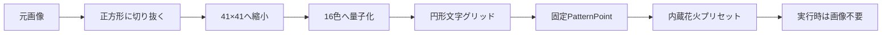

# 静的画像モザイク花火の作成方法

画像を開発時に一度だけ解析し、固定パレットと固定座標へ変換して内蔵花火へ収録する方法を説明する。ブラウザ実行時には元画像を読み込まず、玉内配置ワークベンチの「画像から生成」、SlimSAM、画像配置Workerも呼び出さない。

現在の参照実装は [`src/data/maoTanabataPreset.ts`](../src/data/maoTanabataPreset.ts)、回帰テストは [`src/data/maoTanabataPreset.test.ts`](../src/data/maoTanabataPreset.test.ts) にある。

## 用途と方式の違い

この方式は、特定の画像を調整済みの内蔵見本として配布したい場合に使う。ユーザーが任意の画像を編集画面から変換する機能は [画像から仮想星配置](IMAGE_TO_STARMINE.md) を参照する。

| 項目 | 静的画像モザイク方式 | アプリ内「画像から生成」 |
| --- | --- | --- |
| 変換時期 | 開発時に1回 | ユーザー操作時 |
| 実行時の画像入力 | なし | あり |
| セグメンテーション | 使用しない | SlimSAMまたはfast |
| 収録データ | パレット、文字グリッド、固定座標 | schema v4の手動配置点 |
| 主な用途 | 調整済み内蔵見本 | 任意画像の対話的編集 |



## 1. 元画像を表示範囲へ合わせる

参照実装では1026×1179の画像から上側1026×1026を切り抜き、人物の顔、髪、浴衣、夜空が正方形へ収まる構図にした。その後、LANCZOSで41×41へ縮小した。

解像度を上げるほど形状は明瞭になるが、星数、編集画面の点数、描画負荷が増える。円内を埋める41×41グリッドは1,257点となり、現在の6,000粒子上限に対して余韻演出を追加する余地を残せる。

切り抜き時は次を確認する。

- 顔や主輪郭を円の中央へ寄せる。
- 画像端で切れる要素を主題にしない。
- 暗い背景と輪郭が同化する場合は、後段のパレットで暗色を増光する。
- 元画像をリポジトリへ収録する場合は、権利と公開可否を別途確認する。現在の実装は元画像を収録していない。

## 2. 固定パレットへ量子化する

参照実装は、画像に必要な白、桃、紅、金、水色、青、紺、緑、紫を16色選び、縮小画素をCIELAB色空間で最も近い色へ割り当てた。パレットキーは `0`〜`9`、`A`〜`F` とする。

暗い青や紫は写真に忠実なRGB値のままだと夜空で消えるため、色相を保ったまま明度を引き上げる。さらに仮想星の明るさを次の考え方で補正する。

```ts
const luminance =
  (red * 0.2126 + green * 0.7152 + blue * 0.0722) / 255;
const brightness = 1.34 + (1 - luminance) * 0.38;
```

これにより暗色ほど少し強く発光し、髪の輪郭や夜空の青を残せる。色を増やしすぎると星定義と編集項目が増えるため、人物モザイクでは12〜20色を目安にする。

## 3. 円形文字グリッドへ固定する

41文字×41行の文字列へパレットキーを保存し、円の外側を `.` とする。画像ファイルではなく、この文字グリッドがプリセットの入力データになる。

```text
....................C....................
..............DDBB92BBBBCCB..............
............DB100012000019BBB............
```

各文字を次の式で正規化座標へ変換する。

```ts
const center = (grid.length - 1) / 2;
const x = ((column - center) / center) * 0.82;
const y = ((center - row) / center) * 0.82;
```

`0.82` は肖像半径である。外側に別の光環を置くため、安全半径1.0を使い切らない。`patternLayer` の `depth` は0.025とし、中心点が長さ0のベクトルになることを避けつつ、正面から見た形をほぼ平面に保つ。

## 4. `PatternStarLayer` として構築する

静的グリッドは `PatternPoint[]` に変換し、パレットキーを `groupId` として保持する。`PatternGroup` はキーごとに専用の `VirtualStarPreset` を割り当てる。

重要な点として、schema v2の内蔵見本では `SphericalStarLayer` の手動座標ではなく `PatternStarLayer` を使う。v2の通常球面コンパイルは方向を球面へ正規化するため、中心からの距離で作ったモザイクが外周へ押し広げられる可能性がある。型物のコンパイルは点の大きさを速度へ保持するため、画像の比率が崩れない。

型物レイヤーには次を設定する。

- `template: "custom"`
- `facingPolicy: "audience"`
- `orientationDegrees: 0`
- `rotationJitter: 0`
- `allowedAngle: 12`
- `depth: 0.025` 前後

schema v4へ移行すると、この型物は編集可能な手動配置点へ変換される。v2とv4の両方で星数と形状をテストする。

## 5. 花火らしい外周を加える

肖像だけでは四角い画像や静止画に見えやすいため、半径0.93へ96点の円を追加する。参照実装では金、水色、竹青を順番に割り当て、七夕の星飾りとしている。

```ts
const angle = (index / 96) * Math.PI * 2;
const point = {
  x: Math.cos(angle) * 0.93,
  y: Math.sin(angle) * 0.93,
};
```

肖像1,257点と光環96点の合計は1,353星となる。

## 6. 再現性を固定する

画像の形を毎回同じにするため、プリセットでは打上ごとの揺らぎを0にする。

```ts
design.launchVariation = {
  ignition: 0,
  lifetime: 0,
  placement: 0,
  velocity: 0,
};
design.realism = {
  ignitionJitter: 0,
  lifetimeJitter: 0,
  missingRate: 0,
  placementJitter: 0,
  velocityJitter: 0,
};
```

星単位の速度差や欠落を加える場合は、顔や目が判別できる範囲で小さくする。まず固定状態で形を完成させ、最後に花火らしさを足す。

## 7. 通常版を余韻版へ派生させる

元の静的プリセットを `structuredClone` し、座標を再生成せず発光と運動だけを変更すると、同じ形状の別バージョンを安全に作れる。参照実装の「七夕のまお・淡光」は次の差を持つ。

| 調整項目 | 通常版 | 淡光版 | 狙い |
| --- | ---: | ---: | --- |
| 肖像の速度倍率 | 1.00 | 1.08 | 大きくほどける |
| 肖像の燃焼時間 | 3.45秒 | 4.45秒 | 急に消さない |
| 肖像のdrag | 0.82 | 0.56 | 外へ広がり続ける |
| 肖像の尾 | 0.04秒 | 0.18秒 | 輪郭を柔らかくする |
| 肖像の明度段階 | 3段階 | 5段階 | ふわっと減光する |
| 光環の点火遅延 | 0秒 | 0.12秒 | 肖像の後に見せる |
| 光環の速度倍率 | 1.00 | 0.78 | 外周をゆっくり残す |
| 光環の燃焼時間 | 3.45秒 | 5.8秒 | 余韻を作る |
| 光環の尾 | 0.04秒 | 0.72秒 | 残光を見せる |
| 光環の終端 | なし | 光露1粒 | 静かな消え際 |

肖像の減光は、強度を `1.04 → 0.94 → 0.62 → 0.20 → 0` と段階的に下げる。最後だけ急に0へ落とすと静止画が消灯する印象になるため、70%付近から明確に減衰させる。

### 性能上の注意

長い尾と終端火花を1,257点すべてへ付けると、形の密度以上に描画負荷が増える。淡光版では次の役割分担にする。

- 肖像1,257点: 0.18秒の短い尾、終端火花なし
- 光環96点: 0.72秒の尾、光露1粒

この構成では親星1,353＋終端火花96＝最大1,449粒子に収まる。余韻は少数の専用レイヤーへ集中させる。

## 8. 内蔵見本へ登録する

ビルダーを `src/data/presets.ts` から呼び、元版と派生版へ別IDを与える。

```ts
export const MAO_TANABATA_PRESET =
  buildMaoTanabataPreset(PEONY_PRESET);

export const MAO_TANABATA_AFTERGLOW_PRESET =
  buildMaoTanabataAfterglowPreset(PEONY_PRESET);
```

両方を `FIREWORK_PRESETS` へ追加する。既存見本の順序を前提にする回帰テストがあるため、凍結された既存プリセット群の途中へ挿入せず、配列後方へ追加する。

## 9. 検証する

最低限、次を自動テストで固定する。

- `FireworkDesignV2` として有効である。
- `FIREWORK_PRESETS` に別IDで登録される。
- `star-image-*` を含まず、アプリ内画像生成に依存しない。
- 全レイヤーが `template: "custom"` の型物である。
- 同じseedのコンパイル結果が一致する。
- v4移行後も星数と有限座標を維持する。
- 通常版は1,353星、淡光版は最大1,449粒子である。
- 警告がなく、6,000粒子上限を超えない。
- 淡光版の光環96点だけが長い尾と光露を持つ。

関連テスト:

```bash
rtk npm run test:run -- \
  src/data/maoTanabataPreset.test.ts \
  src/data/summerFireworkPresets.test.ts \
  src/data/realFireworkPresets.test.ts
```

品質確認:

```bash
rtk npx tsc -b --pretty false
rtk npx eslint \
  src/data/maoTanabataPreset.ts \
  src/data/maoTanabataPreset.test.ts \
  src/data/presets.ts
rtk npm run build
```

ブラウザでは次を目視確認する。

1. 花火棚で元版と派生版が別カードになっている。
2. 玉内配置で顔、髪、瞳、浴衣、外周が判別できる。
3. 固定打上プレビューで、肖像が広がりながら減光する。
4. 肖像の後に外周の尾と光露が残る。
5. 湖面確認でブルームが白飛びせず、暗色も消えない。
6. 負荷表示が上限内で、console errorがない。

## 調整の目安

- 形が読めない: グリッドを大きくする前に、切り抜き、パレット、暗色補正を見直す。
- 写真のように硬い: 肖像の `drag` を下げ、燃焼後半の強度を段階的に落とす。
- すぐ消える: `burnDuration` を延ばすが、終端だけを長く引き伸ばさない。
- 余韻が弱い: 全点へ尾を足さず、外周や一部アクセントの燃焼時間と尾を延ばす。
- 形が崩れる: `rotationJitter`、`placement`、`velocity`、`missingRate` を0へ戻して原因を分離する。
- 明るすぎる: 色そのものを暗くする前に、`brightness` と強度後半を下げる。

