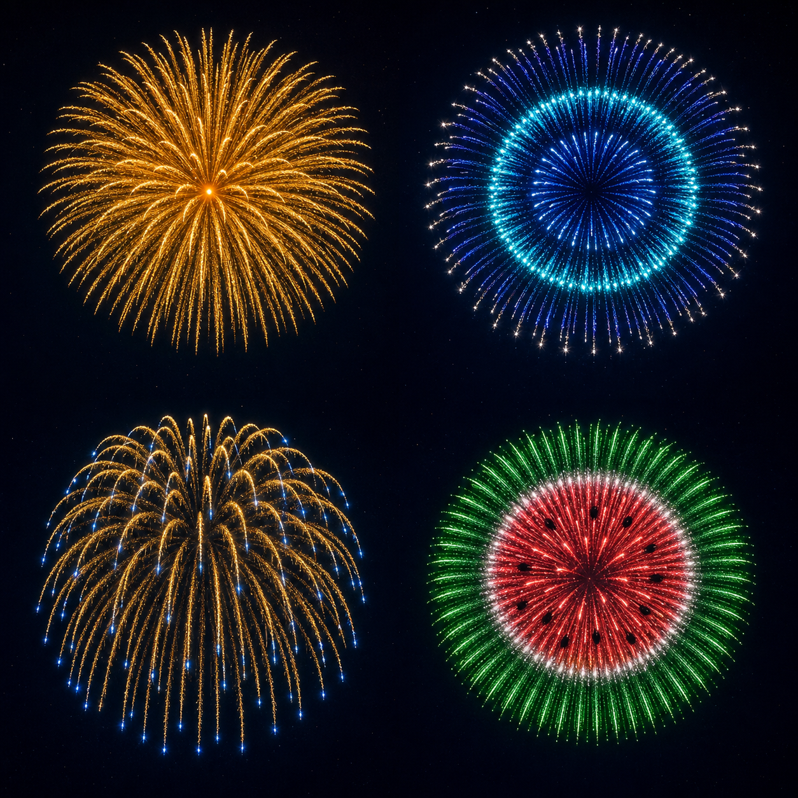

# 夏の単発花火：画像から花火玉への逆算



この画像は `imagegen` の組み込み画像生成で作成した、4種類の単発花火の完成形リファレンスである。画像をランタイムへ読み込むのではなく、各象限の輪郭、色、密度、重力感、残光を固定の仮想星と球殻へ置き換えて、内蔵花火玉として再構成している。

| 画像位置 | 花火玉 | 逆算した構造 | 主な色 | 星数の目安 |
| --- | --- | --- | --- | ---: |
| 左上 | 盛夏の向日葵 | 金の外花弁・内花弁・琥珀芯 | `#FFD65C` `#FFA11F` | 372 |
| 右上 | 涼風の水輪 | 群青外輪・水色中輪・深青芯 | `#35E7FF` `#255BFF` `#F4FBFF` | 436 |
| 左下 | 宵涼みの青先柳 | 長寿命の金柳・金の補助柳・青い終端 | `#FFD36A` `#E89B28` `#4B9DFF` | 228 |
| 右下 | 納涼の西瓜輪 | 緑皮・白境界・赤果肉の三重球殻 | `#43ED69` `#FFFFFF` `#FF4658` | 560 |

## 変換方針

- 4種類とも1つの `FireworkDesignV2` に1発分だけを収録し、複数発を同時に合成しない。
- 生成画像の長時間露光らしい筋は、仮想星の `trailLifetime` と粒状トレイルで再現する。
- 同心円の見かけの半径は `radialSpeedScale` で固定し、水輪は `1.00 / 0.64 / 0.43`、西瓜輪は `1.00 / 0.74 / 0.63` とする。
- 青先柳は燃焼時間の84%から金の頭を青へ変え、尾の金色を残す。
- 西瓜の種は黒い発光体を置かず、赤い果肉層の固定16点を抜いて夜空の穴として見せる。schema v4へ移行しても同じ16点が残る。
- 参照画像へ近い幾何を毎回得るため、配置・速度・寿命の打上揺らぎを小さく固定する。

## 画像生成プロンプト

```text
Use case: stylized-concept
Asset type: visual target for reverse-engineering four in-app firework shell presets
Primary request: Create one cohesive 2×2 visual reference board of four distinctly different Japanese summer-themed aerial fireworks. Each quadrant shows exactly one isolated firework burst at its peak, never multiple bursts in one quadrant.
Scene/backdrop: seamless deep indigo-black summer night sky, subtly atmospheric but with no landscape, buildings, people, labels, dividers, frames, or text
Subjects, one per quadrant: (1) upper left — luminous sunflower-inspired chrysanthemum, dense warm golden-yellow spokes with a small amber core; (2) upper right — cool cyan and deep-blue circular ripple firework inspired by summer water, with two crisp concentric rings and sparse silver tips; (3) lower left — elegant golden weeping-willow firework with long gravity-curved trails, tiny cool blue embers at the ends; (4) lower right — watermelon-inspired ring firework, bright green outer sphere, thin white inner separation ring, vivid coral-red inner stars and a few tiny dark gaps like seeds
Style/medium: premium cinematic long-exposure firework photography, physically plausible sparks, high contrast, fine glitter, clean radial geometry
Composition/framing: square image; uniform 2×2 arrangement; each burst centered in its own quadrant with generous empty night-sky separation; all four bursts similar apparent diameter; no launch trails from the ground
Lighting/mood: festive Japanese summer evening, radiant but controlled bloom, crisp spark detail, graceful fading embers
Color palette: gold and amber; cyan and cobalt; warm gold with blue accents; emerald, white, and coral-red
Constraints: exactly four total burst events, exactly one per quadrant, all fully visible and non-overlapping, designed as deterministic particle-system targets, no typography, no watermark
Avoid: extra fireworks, crowds, city skyline, mountains, reflections, smoke clouds obscuring structure, rockets, launch tubes, borders, captions, logos, asymmetrical cropping
```
