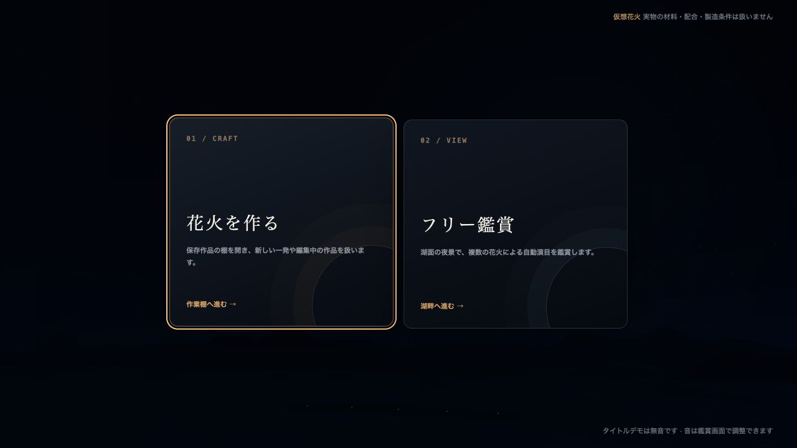
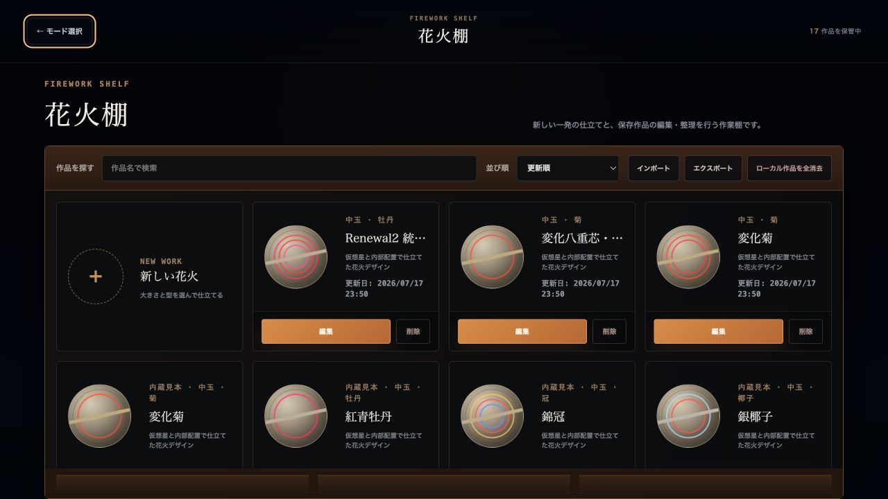
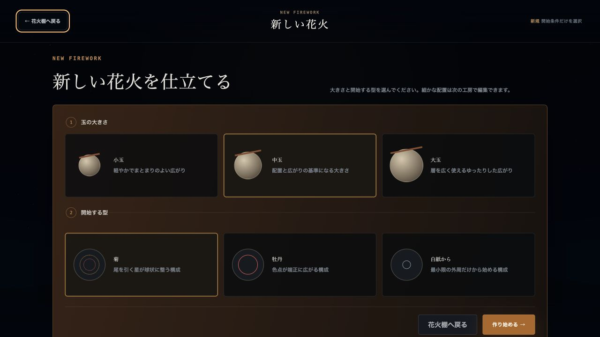
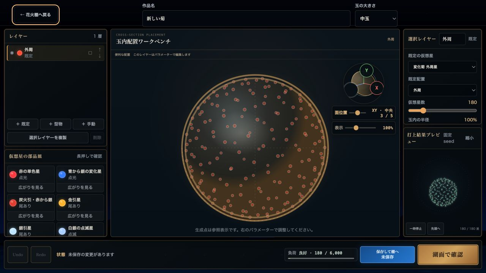
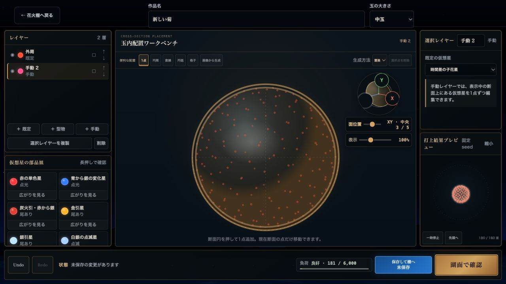
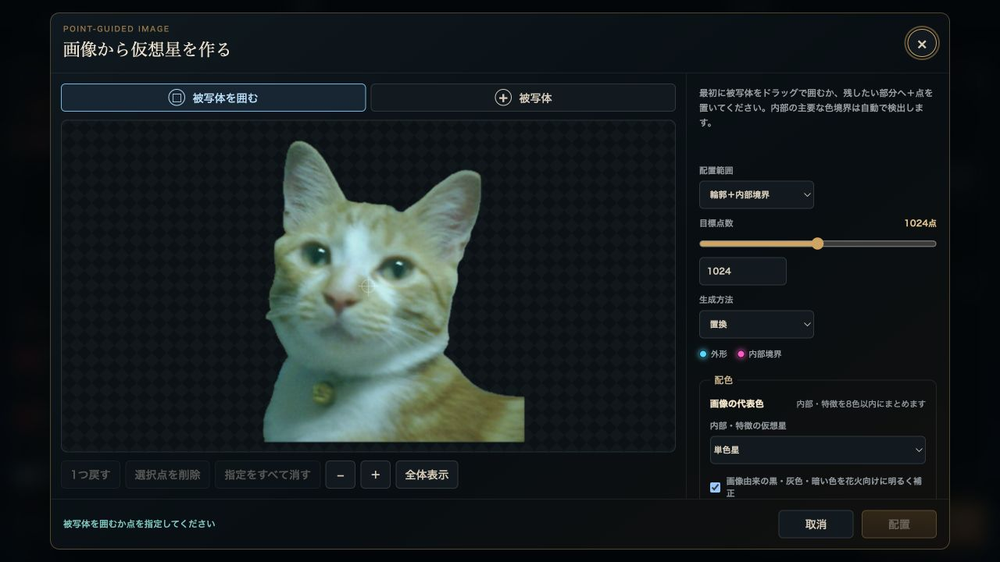
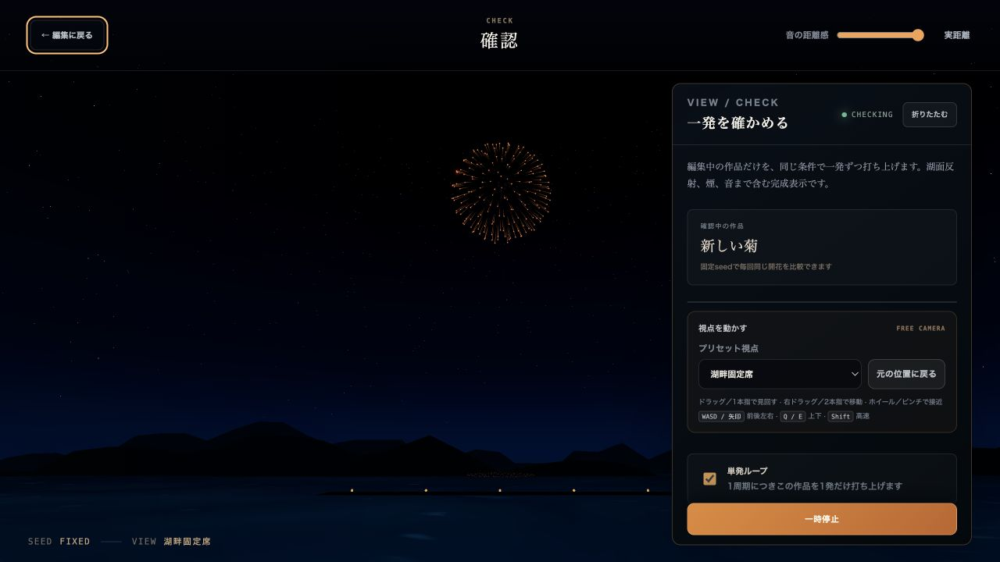
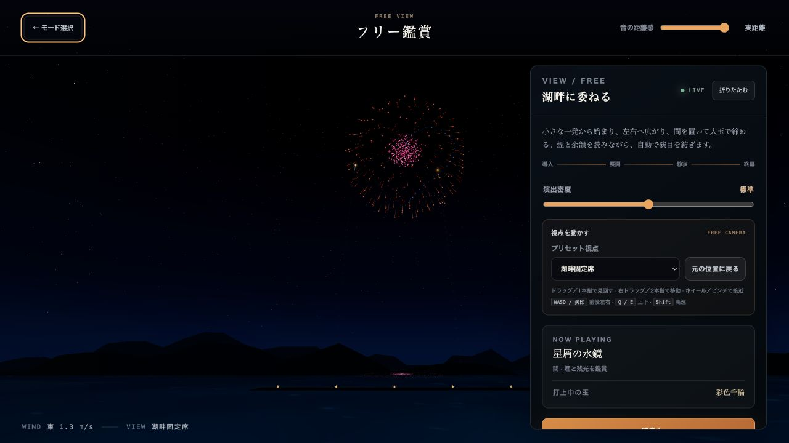

# Codex Starmine 操作ガイド

Codex Starmine は、花火玉の内部に仮想星を配置し、完成した花火を湖畔の夜景で確認・鑑賞できるブラウザシミュレーションです。このガイドでは、花火を1つ作って打ち上げるまでの基本操作と、保存・フリー鑑賞の使い方を説明します。

スクリーンショットはデスクトップ版（1280 × 720）です。モバイル版では編集画面の左右パネルが「レイヤーと星」「設定と確認」ボタンから開くドロワーになります。

## 1. 起動する

公開ページからアクセス
https://maoku.github.io/CodexStarmine/

開発環境では、リポジトリのルートで次を実行します。

```bash
npm install
npm run dev
```

表示されたローカルURLをブラウザで開くと、モード選択画面が表示されます。

## 2. モードを選ぶ



- **花火を作る**: 新しい花火の作成、内蔵見本や保存作品の編集、JSONの入出力を行います。
- **フリー鑑賞**: 複数の花火で構成された自動演目を湖畔で鑑賞します。

初めて遊ぶ場合は「花火を作る」を選びます。

## 3. 花火棚から作品を選ぶ



花火棚は作品の入口です。

- 「新しい花火」から新規作成を始めます。
- 保存作品は「編集」「削除」を利用できます。
- 内蔵見本は「見本から編集」でコピーを開き、元の見本を変更せず編集できます。
- 作品名で検索し、「更新順」「名前順」で並べ替えられます。
- 「エクスポート」で保存作品をJSONへ書き出し、「インポート」で戻せます。

「ローカル作品を全消去」は、このブラウザに保存された全世代の作品データを削除します。内蔵見本と書き出し済みJSONは削除されませんが、操作自体は元に戻せません。

## 4. 新しい花火の開始条件を選ぶ



次の2項目を選び、「作り始める」を押します。

1. **玉の大きさ**: 小玉・中玉・大玉から選びます。大きいほど広い配置とゆったりした広がりになります。
2. **開始する型**: 菊・牡丹・白紙から選びます。白紙は最小限の外周だけで始まります。

迷った場合は、既定の「中玉」「菊」で始めると編集内容を確認しやすくなります。

## 5. 花火を編集する



編集画面は4つの領域に分かれています。

| 位置 | 主な役割 |
| --- | --- |
| 上部 | 作品名と玉の大きさを変更する |
| 左 | レイヤーの追加・選択・並べ替えと、使用する仮想星を選ぶ |
| 中央 | 切断面を選び、玉の内部配置を確認・編集する |
| 右 | 選択レイヤーの数値設定と、固定seedの打上結果プレビューを確認する |
| 下部 | Undo/Redo、未保存状態、描画負荷、保存、湖面確認を操作する |

### レイヤーを使い分ける

- **既定**: 外周・芯・子花・枝などをパラメーターで生成します。
- **型物**: 円・ハート・星・四角・三角・六角形を配置し、大きさ・密度・回転を調整します。
- **手動**: 現在の切断面へ点を追加し、1点ずつ移動・削除できます。

各レイヤーは表示切替、ロック、上下移動、複製ができます。ロック中のレイヤーは編集できません。左側の仮想星を選ぶと、選択レイヤーへ割り当てられます。「広がりを見る」または仮想星の長押し、キーボードの `Space` で星単体の動きを確認できます。

### 切断面と表示を操作する

- `X` はYZ面、`Y` はXZ面、`Z` はXY面を選びます。
- 「面位置」で同じ向きの5段階の切断位置を移動します。
- 「表示」で玉の表示倍率を調整します。
- 右側の「打上結果プレビュー」は、本番と同じ配置を軽量表示します。「一時停止」「先頭へ」で比較できます。

### 手動配置と画像配置を使う



「＋ 手動」で手動レイヤーを追加すると、中央上部に配置ツールが表示されます。

- 「1点」は断面を押して点を追加し、既存点をドラッグして移動します。
- 「円周」「直線」「円弧」「格子」は、指定した形へ等間隔で点を生成します。
- 「生成方法」は、現在の点を入れ替える「置換」と、残したまま足す「追加」を選べます。
- 点を選んで「選択点を削除」を押すと、その点だけ削除できます。

#### 画像から仮想星を作る



1. 手動レイヤーを選択し、「画像から生成」を押して画像を選びます。
2. 画像上で被写体をドラッグして囲むか、「被写体」で残したい場所を指定します。処理方式に応じて「特徴」「背景を除外」も表示されます。
3. 「配置範囲」を輪郭のみ、輪郭＋内部境界、輪郭＋内部境界＋内部から選びます。
4. 目標点数、置換／追加、内部・特徴の発光方式、暗色補正、輪郭に使う仮想星を調整します。
5. 解析が完了して「配置」が有効になったら押します。生成点は通常の手動点なので、その後も移動・削除・Undo/Redoができます。

画像は20MB以下、デコード後24メガピクセル以下を使用してください。画像処理はブラウザ内で行われ、画像本体やファイル名は作品データに保存されません。初回は解析モデルの準備に時間がかかることがあります。

### 保存する

「保存して棚へ」を押すと、現在の作品がブラウザの `localStorage` に保存され、花火棚へ戻ります。ブラウザやプロファイルを変えると同じ保存領域を参照できないため、大切な作品は花火棚からJSONへエクスポートしてください。

未保存の変更がある状態で花火棚へ戻ろうとすると、変更を破棄するか確認されます。

## 6. 湖面で一発を確認する



編集画面の「湖面で確認」を押すと、編集中の作品だけを固定seedで繰り返し打ち上げます。配置の違いを毎回同じ条件で比較でき、湖面反射・煙・音を含む完成表示を確認できます。

- 「一時停止」で再生を止めます。
- 「単発ループ」を切ると自動反復を停止できます。
- 「プリセット視点」で湖畔固定席、湖畔ワイド、打上島そば、花火の内側を切り替えます。
- 「音の距離感」で、実距離に近い遅延と即時寄りの演出を調整します。
- 「編集に戻る」で同じ作品の編集を続けます。

## 7. フリー鑑賞を楽しむ



モード選択から「フリー鑑賞」を開くと、内蔵見本と保存作品を使った自動演目が始まります。

- 「演出密度」で同時打上や展開の密度を変更します。
- `NOW PLAYING` で現在の演目と打上中の玉を確認できます。
- 「一時停止」で演目を止め、同じボタンで再開します。
- 保存作品がある場合は、自動演目の中でその作品も主役として使われます。

### カメラ操作

| 操作 | 動き |
| --- | --- |
| ドラッグ／1本指 | 見回す |
| 右ドラッグ／2本指 | 視点を平行移動する |
| ホイール／ピンチ | 接近・後退する |
| `WASD`／矢印 | 前後左右へ移動する |
| `Q`／`E` | 上下へ移動する |
| `Shift`を押しながら移動 | 高速移動する |

「元の位置に戻る」で選択中のプリセット視点へ戻せます。確認画面でも同じカメラ操作を利用できます。

## 8. JSONでバックアップ・復元する

1. 花火棚の「エクスポート」で、保存作品をJSONファイルへ書き出します。
2. 復元するときは「インポート」でJSONを選びます。
3. 同じIDの作品がある場合は、「重複をスキップ」または「置き換える」を選びます。置き換えるとJSON側の内容と更新日時が採用されます。

## 9. 困ったとき

- **音が出ない**: ブラウザの自動再生制限により、最初のクリックまたはキー入力後に音が有効になります。端末とタブの音量も確認してください。
- **編集が重い**: 画面下の「負荷」を確認し、仮想星数やレイヤー数を減らしてください。打上結果プレビューは最大256星へ自動的に簡略化されます。
- **画像から生成が見つからない**: 手動レイヤーを追加して選択し、ロックを解除してください。
- **画像の「配置」が押せない**: 被写体の範囲または被写体点を指定し、解析の完了を待ってください。上限を超える画像や被写体を検出できない画像では配置できません。
- **作品が別のブラウザにない**: 作品はブラウザごとの `localStorage` に保存されます。元のブラウザからJSONをエクスポートして移してください。

## 関連資料

- [ドキュメント一覧](README.md)
- [画像から仮想星配置の確定仕様](IMAGE_TO_STARMINE.md)
