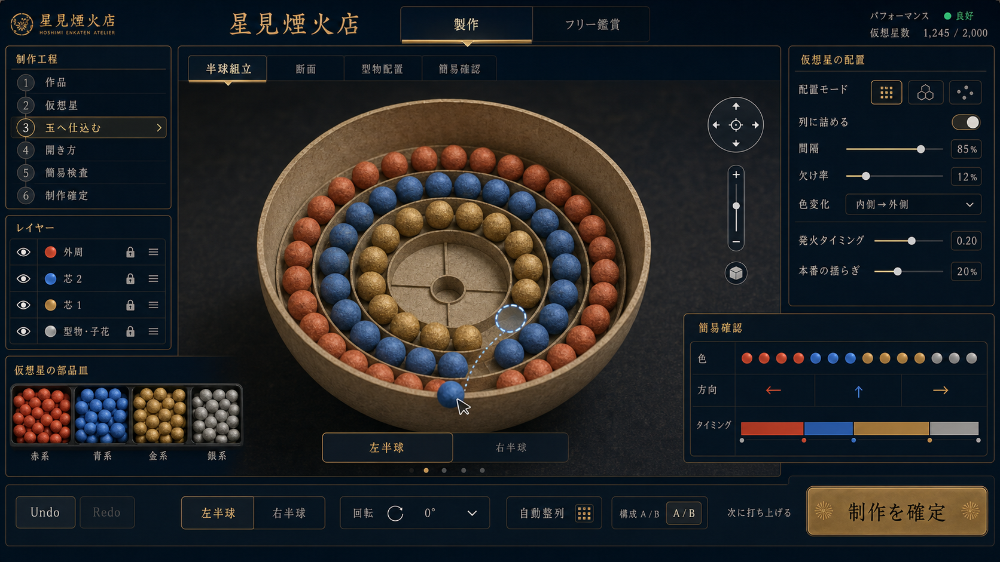

# 打ち上げ花火製作シミュレーション 実装計画書

- 作成日: 2026-07-14
- 根拠資料: [Docs/plans/PLAN.md](PLAN.md)、[Docs/RESEARCH.md](../RESEARCH.md)
- 製作モード強化: [花火内部配置エディター強化 実装計画書](CRAFT_EDITOR_IMPLEMENTATION_PLAN.md)
- 画面遷移リニューアル: [画面遷移・編集体験リニューアル 改修計画書](RENEWAL_IMPLEMENTATION_PLAN.md)
- 編集体験Renewal2: [編集体験Renewal2 改修実装計画書](RENEWAL_IMPLEMENTATION_PLAN2.md)
- 対象: ブラウザで動作する花火の製作・鑑賞ゲームアプリ

## 1. ゴールと成功条件

ユーザーが花火玉をデザインし、湖畔の夜景で打ち上げて鑑賞できるブラウザアプリを作る。

成功条件は RESEARCH.md 9.12節と13章の受け入れ基準に準拠する。要点:

- 菊・牡丹・冠・椰子・千輪・型物が、尾・寿命・消え方まで含めて見分けられる
- 3号・5号・10号で高度・開花径・発光量・音・煙量の差が一貫している
- 同じ花火デザインを単発でもスターマインでも再利用できる
- 外周・芯・型物・子花を独立レイヤーとして編集し、同じseedで結果を再現・比較できる
- 湖面に花火が映り込み、写実的な夜景として成立している
- 音が距離遅延を持ち、300m相当で約0.9秒遅れて届く

## 2. 技術スタック

| 領域 | 採用技術 | 備考 |
| --- | --- | --- |
| 言語 | TypeScript | 型付きデータモデル（FireworkDesign 等）が中心のため必須 |
| ビルド | Vite | 開発サーバ・HMR・静的ビルド |
| レンダリング | three.js（WebGL 2） | PLAN.md 指定。ポストプロセスは `EffectComposer` + `UnrealBloomPass` ほか |
| 粒子物理 | 自作バリスティック積分器 | 星の弾道（初速・抗力・重力・風）は単純な質点運動のため専用実装が最適 |
| 音声 | Web Audio API | 効果音レイヤー、距離遅延、音楽解析（AnalyserNode / OfflineAudioContext） |
| 永続化 | localStorage → IndexedDB | 花火デザイン・ショーの保存。MVP は localStorage、容量が問題になれば移行 |
| テスト | Vitest | データモデル・タイムライン・音楽解析などロジック層の単体テスト |

写実性の方針（RESEARCH 7.3 / 10章に基づく）:

- HDR レンダリング + ACES トーンマッピング + 追従速度を制限した自動露出
- 粒子は「中心コア／グロー／トレイル」を分けた加算合成。多数同時でも白飛びを抑える
- 湖面は平面反射（Reflector 改造）+ 法線マップによる波の揺らぎ
- 煙はビルボードパーティクルの蓄積 + 花火光による散乱着色

## 3. アーキテクチャ

```
src/
  core/      シミュレーション（レンダリング非依存）
    particle/    星のバリスティック、寿命、色ステージ
    burst/       開花形状の生成（球・芯・子玉・型物点群）
    show/        ShowCue タイムラインの再生エンジン
    env/         風、煙の蓄積、音速遅延の計算
  render/    three.js 層
    scene/       夜空、湖、地形、観客視点カメラ
    fx/          粒子描画、トレイル、ブルーム、露出、湖面反射
  audio/     効果音レイヤー、距離遅延、音楽解析
  data/      FireworkDesign / ShowCue のスキーマ、プリセット、保存・読込
  modes/     craft（製作）、viewFree（フリー鑑賞）、viewMusic（音楽連動）
  ui/        エディタUI、タイムラインUI、モード切替
```

設計原則:

- **core はレンダリングに依存しない。** シミュレーション結果（粒子の位置・色・輝度）を render 層が消費する一方向構造にし、単体テストを可能にする。
- **1つの FireworkDesign から光・音・煙を同時駆動する**（RESEARCH 3章）。
- ショーは花火オブジェクトの配列ではなく **時刻付き ShowCue の列** として保存し、単発・スターマイン・音楽連動を同一エンジンで再生する（RESEARCH 6.2）。

### データモデル（RESEARCH 8.1 / 9章 / 6.2 準拠）

- `FireworkDesign`: family（割物/ぽか物/半割物）、pattern、sizeClass、burstShape、coreLayers[]、childBursts[]、colorStages[]、trailStyle、gravityScale、drag、windResponse、soundProfile、smokeProfile ほか
- `FireworkDesignV2`: 仮想星定義、外周・芯・型物・子花レイヤー、固定seed、写実度を追加し、v1から非破壊移行する（詳細は製作モード強化計画）
- `FireworkDesignV4`: `preset / pattern / manual` の編集意図、XY／XZの5断面、型物レシピを正本として保存し、描画時に決定的なv3互換配置へ解決する。v1／v2／v3キーは削除しない
- `ShowCue`: time、launcherLane、launchAngle、fireworkDesignID、sizePreset、targetHeight、timingVariation
- サイズプリセット: Small(3号)・Medium(5号)・Large(10号)。高度・開花径・粒子数・発光量・低音・煙量を連動させる（RESEARCH 5.2）

## 4. フェーズ計画

各フェーズの完了時に動作確認のうえ commit する（PLAN.md のバージョン管理方針）。フェーズ内でも機能単位で commit する。

### Phase 0: プロジェクト基盤（完了: 2026-07-14）

- [x] Vite + TypeScript + three.js の雛形、ESLint/Prettier、Vitest、`src/` 構成の骨組み
- [x] 空の夜空シーンがブラウザに表示されること
- **完了確認**: `npm run lint`、`npm run test:run`（3件成功）、`npm run build` が成功。1280×720 のブラウザで WebGL 2 キャンバス、夜空、Phase 0 ステータスを確認

### Phase 1: 夜景シーン基盤（湖畔）（完了: 2026-07-15）

- [x] 星空スカイドーム、遠景シルエット、湖面（静的反射 + 波法線）、打上サイト
- [x] 固定観客視点カメラ（RESEARCH 11.3: 標準鑑賞では観客位置と画角を固定）
- [x] HDR + ブルーム + トーンマッピング + 露出制御のポストプロセス基盤
- **完了基準**: 月明かりの湖畔夜景が写実的に見え、湖面に空が映る
- **完了確認**: 星空・月・山影・湖面シェーダー・打上島を実装。1280×720 の固定観客視点で夜空と波立つ湖面をブラウザ確認

### Phase 2: 花火コアシミュレーション（菊・牡丹）（完了: 2026-07-15）

- [x] 打上（昇り）→ 開花 → 減速・落下・消滅の粒子ライフサイクル
- [x] バリスティック積分器: 初速膨張、抗力による減速、重力、一定風（RESEARCH 10.1）
- [x] 球面均等分布バースト、トレイル描画、colorStages による寿命沿いの色変化
- [x] 菊（長い尾）と牡丹（点光源）の2プリセット
- **完了基準**: 菊と牡丹を消え方まで含めて見分けられる。湖面に開花が映る
- **完了確認**: レンダリング非依存の弾道・色補間・球面点群と、動的粒子・尾・湖面反射を実装。菊の長い尾と牡丹の短い点光を別プリセットとして確認

### Phase 3: 花火バリエーションとサイズ（完了: 2026-07-15）

- [x] 冠（長寿命・強い垂れ）、椰子（太く少ない花弁）、千輪（子バーストの遅延発火）、型物（ハート点群、鑑賞優先の姿勢制御）
- [x] 芯: 一重・二重（coreLayers による同心球）
- [x] 3号・5号・10号スケール（高度・開花径・粒子数・発光量を連動）
- [x] 打上ごとの揺らぎ: 風・高度・角度・タイミングの微小ばらつき（PLAN.md「同じ玉でも見た目に変化」）
- **完了基準**: 6種 × 3サイズが受け入れ基準どおり判別できる
- **完了確認**: 6プリセット、3サイズ、一重・二重芯、千輪の遅延子花、カメラ向きハート点群、椰子の枝状点群を実装。サイズは高度・径・密度・点光サイズを連動

### Phase 4: 音・煙・環境（完了: 2026-07-15）

- [x] 効果音レイヤー: 打上音、開花低音、パチパチ音、反響（RESEARCH 10.3）
- [x] 距離による音の遅延（distance / 343 秒）と、演出優先時の遅延緩和設定
- [x] 煙の蓄積システム: 上昇煙跡、開花煙、風下への流れ、後続花火光の散乱（RESEARCH 10.2）
- [x] 開花時の環境ライティング（空・湖面・地形への一瞬の照り返し）
- **完了基準**: 300m相当で光の約0.9秒後に音が届く。煙が風下へ流れ後続の光を受ける
- **完了確認**: 300mで約0.875秒となる音速遅延を単体テストで確認。合成音4層、上昇煙・開花煙、風移流、後続光の煙散乱、湖面と環境のフラッシュを実装

### Phase 5: 製作モード（完了: 2026-07-15）

- [x] エディタUI（RESEARCH 11.1 の順序）: 種類 → 大きさ → 芯 → 色変化 → 尾 → 子花・昇曲 → 単発プレビュー
- [x] パラメータは「丸さ」「花弁の太さ」「尾の長さ」など見た目の言葉で提示
- [x] プリセットからのカスタム（パーツ入れ替え）と1からの製作の両対応（PLAN.md）
- [x] デザインの保存・読込・複製・削除（localStorage）
- **完了基準**: プリセットを改変した自作花火を保存し、プレビューで打ち上げられる
- **完了確認**: 1280×720 と 390×844 で製作UIを確認。「湖上の恋花」を作成し、保存・再読込・単発プレビューまでブラウザ操作で確認

### Phase 6: 鑑賞モード（フリー）（完了: 2026-07-15）

- [x] ShowCue タイムライン再生エンジン（単発・連続・連発・スターマイン）
- [x] フリーモード: 製作済み＋プリセットからランダム選択し、密度と「間」を制御した自動演出（RESEARCH 6.3 の構成パターンをテンプレート化）
- [x] 自由視点: マウス・タッチによる回転／平行移動／接近、WASD・矢印・Q/E・Shiftによる3軸キーボード移動、湖畔・広角・打上島・花火内部の4プリセット、湖畔固定席へのリセット
- **完了基準**: 放置で観賞に耐えるランダムショーが流れ、自作花火が混ざって上がる
- **完了確認**: 導入→左右展開→煙と残光の「間」→スターマイン終幕を29秒単位で循環。保存済みデザインを必ず1回以上採用し、密度3段階・一時停止・再開を実装。フリー鑑賞中だけ有効な自由視点と4プリセット・位置リセットを追加し、ブラウザで連続打上、花火内部への接近、湖面、UI遷移、コンソールエラーなしを確認

### Phase 6.5: 製作モード強化・内部配置エディター（完了: 2026-07-15）



> 制作中は玉皮内の配置と、色・方向・タイミングの簡易検査だけを表示する。実際の開花形状は、制作確定後に湖畔で打ち上げるまで表示しない。

- [x] `FireworkDesign` v2、仮想星ライブラリ、外周・芯・型物・子花レイヤー
- [x] 実物の花火制作を思わせる半球の玉皮と、球状の仮想星をつまむ・置く・列へ詰める内部配置UI
- [x] 半球組立、断面、型物配置、色・方向・タイミングだけの簡易確認の4表示
- [x] Undo/Redo、構成A/B、描画負荷の警告、制作確定後に初めて完成形を見せる打上導線
- [x] v1保存作品の非破壊移行と既存6プリセット・フリー鑑賞の回帰確認
- **詳細計画**: [花火内部配置エディター強化 実装計画書](CRAFT_EDITOR_IMPLEMENTATION_PLAN.md)
- **完了基準**: RESEARCH 9.12の全項目と「完成形を事前表示しない」要件に合格し、「変化八重芯菊」「2色のハート型物」「時間差を持つ千輪」を玉内へ配置・保存・再読込でき、制作確定後の打上で初めて完成形を鑑賞できる
- **完了確認**: v2モデル・8種の仮想星・決定的コンパイラ・v1非破壊移行・4表示ワークベンチ・100件Undo/Redo・A/B・負荷診断・確定打上を実装。自動テスト、lint、production buildに合格し、1280×720・1024×768・390×844のブラウザで内部配置、保存再読込、確定後の初回打上、フリー鑑賞、コンソールエラーなしを確認

> Phase 6.5の4表示ワークベンチと制作確定導線は、後続の画面遷移・編集体験リニューアルで統合編集とcheck/free共通湖面画面へ置き換えた。

### 画面遷移・編集体験リニューアル（完了: 2026-07-16）

- [x] モード選択、花火棚、初期設定、統合編集、check/free共通湖面画面へ責務を分離
- [x] ユーザーの制作意図だけを保存するv3モデルと、v2キーを残す非破壊移行
- [x] 4×4配置面、円形／ハート／手動配置、星の長押し確認、常設の軽量簡易確認
- [x] `SingleLoopCheckController` による固定seed・1周期1発の湖面確認と、free controllerとの排他切替
- [x] モバイルドロワー、キーボードフォーカス、読み上げ名、動きの軽減設定を含むアクセシビリティ調整
- **詳細計画**: [画面遷移・編集体験リニューアル 改修計画書](RENEWAL_IMPLEMENTATION_PLAN.md)
- **完了確認**: 1280×720・1024×768・390×844で全画面フロー、保存と削除復元、check/free、未保存離脱を実ブラウザ確認。`npm run lint`、89件の単体テスト、production buildに合格し、全幅で横スクロールとブラウザコンソールエラーがないことを確認

### 編集体験Renewal2（完了: 2026-07-16）

- [x] 店名依存を削除したタイトルと、低密度・無音・reduced motion対応のアドバタイズデモ
- [x] v4編集意図、v1→v2→v3→v4／v3→v4の非破壊移行、固定seed回帰比較
- [x] 編集ヘッダーの作品情報と、左ペインに集約した `既定 / 型物 / 手動` の追加・複製・削除
- [x] XY／XZと10／30／50／70／90%の断面ワークベンチ、他断面・他レイヤー参照表示
- [x] 決定的な円／ハート型物レシピ、手動の置換／追加と1点編集、authoring mode別の操作権限
- [x] ビューポート内へ反転する星オーバーレイ、内部スクロール設定と固定の簡易確認、モバイルドロワー
- **詳細計画**: [編集体験Renewal2 改修実装計画書](RENEWAL_IMPLEMENTATION_PLAN2.md)
- **完了確認**: 新規作品を型物72点と手動36点で作成し、保存・再読込後もXZ 30%の断面と座標を保持したまま湖面確認へ進み、編集へ戻れることを実ブラウザで確認。1440×900・1280×720・390×844で最終画面を記録し、`npm run lint`、121件の単体テスト、production buildに合格

### 編集体験Renewal3（完了: 2026-07-16）

- [x] `legacyIntent` に依存せず現在のv4編集意図をコンパイルし、玉内位置の大きさと重心を初速度へ保持
- [x] 3D玉とXYZギズモによる切断面ナビゲーション、数値式断面コントロールの撤去
- [x] 円・ハート・星・四角・三角・六角形の型物と、円周・直線・円弧・格子の手動配置支援
- [x] 本番 `CompiledBurstPlan`、固定seed、共通粒子更新を使う最大256星の打上結果プレビュー
- [x] check/free共通の自由カメラと4プリセット、月・月光筋を除いた非周期多層波の湖面
- [x] v4保存・再読込、デスクトップ／モバイル／200%相当表示、reduced motion、最終スクリーンショットの統合検証
- **詳細計画**: [編集体験Renewal3 改修実装計画書](RENEWAL_IMPLEMENTATION_PLAN3.md)
- **完了確認**: 移行作品と新規作品でハート・星・四角・手動直線を保存・再読込・再コンパイルし、checkで同じ星形が開花することを確認。1440×900・1280×720・390×844、200%相当CSS viewportで主要操作へ到達でき、30秒の湖面観察で規則的な縞を認めなかった。`npm run lint`、149件のテスト、format check、警告なしのproduction buildに合格

### Phase 7: ミュージック連動モード

- 音楽ファイルの入力方式はローカルファイル選択のみ
- ユーザー指定の音楽ファイルを OfflineAudioContext で事前解析: オンセット（ビート）検出、帯域別エネルギー、盛り上がり推定
- 解析結果 → ShowCue 列への変換ルール: 低音オンセット=大玉、高域=小玉連発、サビ=スターマイン、静部=「間」
- 再生同期（AudioContext.currentTime 基準）と打上リードタイムの補正（開花が拍に合うよう昇り時間分先行発射）
- **完了基準**: 任意の楽曲で、拍に合った開花と曲想に合った密度変化が体感できる

### Phase 8: 仕上げ・最適化

- LOD / 粒子数の動的調整、モバイル含む負荷対策（RESEARCH 5.2: 号数へ単純比例させない）
- 受け入れ基準（RESEARCH 9.12節・13章）の全項目チェックと調整
- UI 仕上げ、操作説明、仮想花火である旨の表記（RESEARCH 14章）

## 5. マイルストーンと依存関係

```
Phase 0 → 1 → 2 → 3 → 4 → 5 → 6 → 6.5 → 7 → 8
                 └─ Phase 5 は Phase 3 完了後に Phase 4 と並行可能
                                      └─ Phase 7 は Phase 6.5のモデル移行完了後に並行可能
```

- **M1（Phase 2 完了、2026-07-15）**: 「花火が上がるゲーム」として最初に見せられる状態
- **M2（Phase 5 完了、2026-07-15）**: 製作モードが成立（コアバリュー達成）
- **M2.5（Phase 6.5 完了、2026-07-15）**: 内部配置を含む花火デザイン体験が成立
- **M2.6（画面遷移リニューアル完了、2026-07-16）**: 作品管理・統合編集・単発確認・フリー鑑賞を目的別の画面として利用可能
- **M2.7（編集体験Renewal2完了、2026-07-16）**: v4編集意図と5断面による型物／手動配置、固定プレビュー、端で欠けない星オーバーレイを利用可能
- **M2.8（編集体験Renewal3完了、2026-07-16）**: 3D切断面、6種型物、配置支援、本番planプレビュー、check自由カメラ、月のない多層波湖面を利用可能
- **M3（Phase 7 完了）**: PLAN.md の全モード実装完了

## 6. git 運用

- `main` に機能単位で commit（PLAN.md 指定）。メッセージは `feat: 菊・牡丹バースト実装` のようにフェーズ内の機能が分かる粒度にする
- 各 Phase 完了時の commit には Phase 番号を明記する（例: `feat(phase-2): 花火コアシミュレーション完了`）

## 7. テスト方針

- **単体テスト（Vitest）**: colorStages の補間、バースト形状の点群生成、ShowCue スケジューラ、音遅延計算、音楽解析のオンセット検出
- **目視確認**: 各フェーズの完了基準はレンダリング品質を含むため、ブラウザでの確認を必須とする
- **受け入れテスト**: RESEARCH 9.12節と13章、および `RENEWAL_IMPLEMENTATION_PLAN3.md` 9章をチェックリスト化し、編集体験Renewal3とPhase 8で全項目を確認する

## 8. リスクと対策

| リスク | 影響 | 対策 |
| --- | --- | --- |
| 粒子数による性能劣化（千輪・スターマイン時） | フレーム落ちで写実性が崩れる | 初期からインスタンシング/GPU寄りの粒子設計。LODを Phase 8 でなく必要になった時点で導入 |
| 湖面反射のコスト | 反射用の再描画が高負荷 | 反射パスは花火とスカイのみ描画・解像度を落とす |
| 音楽解析の精度 | 拍とズレると体験が大きく劣化 | 事前解析（オフライン）方式にし、リアルタイム解析は採らない。テンポ推定が不安定な曲はエネルギー連動へフォールバック |
| 加算合成の白飛び | 多数同時打上で色が失われる | 露出制御 + 輝度の上限管理を Phase 1 の基盤に組み込む |
