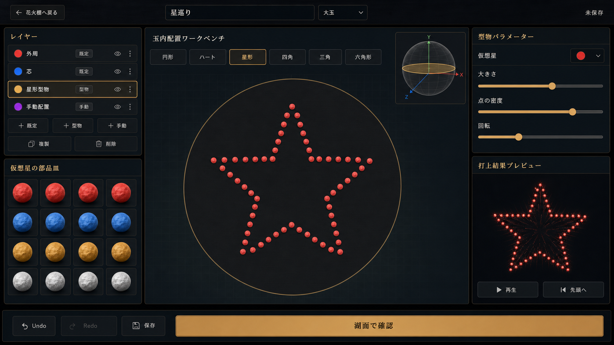

# 編集体験リニューアル3 改修計画書

- 作成日: 2026-07-16
- ステータス: 実装中（Renewal3 Phase 0 完了）
- 基準資料: [RENEWAL_PLAN3.md](RENEWAL_PLAN3.md)
- 先行計画: [RENEWAL_IMPLEMENTATION_PLAN2.md](RENEWAL_IMPLEMENTATION_PLAN2.md)
- 関連資料: [CRAFT_EDITOR_IMPLEMENTATION_PLAN.md](CRAFT_EDITOR_IMPLEMENTATION_PLAN.md)、[RESEARCH.md](../RESEARCH.md)
- 対象: タイトル、玉内配置ワークベンチ、型物、手動配置、簡易確認、湖面確認、フリー鑑賞、夜景



## 1. 目的

Renewal2では、`既定 / 型物 / 手動` の3編集方式、XY／XZの5断面、型物の円／ハート、手動点編集、固定の簡易確認、湖面での単発確認まで実装した。Renewal3では、そこで明らかになった「編集画面では正しく見えるが、打上結果へ同じ形で届かない」という不一致を最優先で解消する。

本改修の完了状態は次のとおり。

1. タイトル背景で花火が常に視認でき、制作／鑑賞の入口を妨げない。
2. 玉内配置ワークベンチ右上に、選択中の切断面を示す3Dの玉とXYZギズモがある。
3. `断面の向き`、`断面位置`、`XY / XZ`、`10〜90%` を設定UIとして表示しない。
4. 型物は現在の切断面へ配置され、切断面からはみ出さない範囲で大きさを変更できる。
5. ハート、円、星、四角、三角、六角形を決定的な点群として生成できる。
6. ハートを選んだ作品が湖面確認でもハートとして開花し、玉内の配置位置も反映される。
7. 手動配置でポインター位置と仮想星の表示位置が一致する。
8. 手動配置で円周、直線、円弧、格子の配置支援を利用できる。
9. 配置全体の簡易確認と湖面確認が同じコンパイル結果、seed、運動更新を使う。
10. 湖面確認でもフリー鑑賞と同じ自由視点操作を利用できる。
11. 月と月光の筋を表示しない。
12. 湖面に規則的な繰り返し模様が見えず、花火の反射と波の細部が自然に変化する。

本機能は仮想花火の視覚設計だけを扱う。実物の材料、配合、寸法、点火条件、製造手順はデータ、UI、ヘルプへ導入しない。

## 2. 現状調査と原因仮説

### 2.1 現在の実装状態

| 要求領域 | 現在の実装 | Renewal3での扱い |
| --- | --- | --- |
| タイトル背景 | `AdvertiseDemoController` と `AdvertiseCameraController` を実装済み | 新規ランタイムを増やさず、表示保証と回帰テストを追加 |
| 断面選択 | `XY / XZ` と `10 / 30 / 50 / 70 / 90%` を中央上部へ表示 | 数値式コントロールを撤去し、3D玉ナビゲーターへ置換 |
| 型物 | 円とハート、サイズ、密度、回転を実装済み | 幾何テンプレート追加、切断面内クランプ、打上反映を修正 |
| 手動配置 | SVG上の追加、移動、削除、星置換を実装済み | SVG座標変換をCTM基準へ変更し、配置支援を追加 |
| 簡易確認 | レイヤーごとの抽象的な8点リング | 本番と同じ `CompiledBurstPlan` を軽量投影して再生 |
| 湖面確認 | 固定視点の単発ループ | フリー鑑賞と同じ自由カメラを有効化 |
| 夜景 | 月、周期的な正弦波の湖面、月光の反射筋 | 月を撤去し、非周期の多層波へ変更 |

### 2.2 打上結果へ編集が届かない経路

現行の `resolveFireworkDesignV4()` は `legacyIntent` がある作品では、編集後の `design.layers` ではなく `legacyIntent.layers` を実行用レイヤーとして採用する。この分岐に入る移行作品では、型物をハートへ変更しても湖面確認が旧い円形／球形のままになる可能性がある。

さらに、v4の型物は `resolveLayerIntent()` で手動配置の `spherical` レイヤーへ変換され、`compileSpherical()` で配置ベクトルを正規化する。これにより、切断面内で持っていた大きさと中心からの距離が失われ、配置画面と打上軌道の対応が弱くなる。

Renewal3では次を契約とする。

- `legacyIntent` は移行比較とロールバック参照だけに使い、実行時の編集正本には使わない。
- v4作品は必ず現在の `LayerIntentV4[]` からコンパイルする。
- 型物／手動の3D配置ベクトルは、意図した大きさを保持する専用経路で初速へ変換する。
- 編集、簡易確認、湖面確認は同じ正本を通る。

### 2.3 手動配置のポインターずれ

現行の `#canvasLocalPoint()` は `getBoundingClientRect()` の幅と高さを、そのままSVGの `600 × 544` viewBoxへ線形変換している。SVGの `preserveAspectRatio` による余白、CSS上の実描画領域、モバイルドロワーの拡縮があると、見えている点と計算上の点がずれる。

Renewal3では `DOMPoint` と `SVGGraphicsElement.getScreenCTM().inverse()` でクライアント座標をSVG座標へ変換する。CTMが得られない場合だけ、明示的に余白を差し引くフォールバックを使う。

### 2.4 簡易確認と本番の乖離

現行 `ApproximateSpreadRenderer` はレイヤーごとに8点の円を描く独立モデルであり、本番の星数、型物座標、タイミング、重力、減速を使用していない。そのため、簡易確認が実際の打上結果と一致しないのは仕様上避けられない。

Renewal3では独立した近似モデルを廃止し、同一の `CompiledBurstPlan` を2Dへ投影する `CompiledBurstPreviewRenderer` へ置き換える。表示粒子数だけを決定的な間引きで抑え、軌道計算は本番と共通化する。

### 2.5 現在の品質基準

計画作成時点の確認結果:

- `rtk npm run lint`: 成功。
- `rtk npm run build`: 成功。生成JSが約747 kBで、550 kB超のチャンク警告あり。
- `rtk npm run test:run`: 34ファイル中33成功、121件中119成功。
- 失敗中: `renewalBaseline.test.ts` のプリセットplan hash 6件と、保存v2 fixtureのplan hash 1件を含む2テスト。

実装開始時に、基準ハッシュの変化が意図したコード変更か、非決定性か、fixture更新漏れかを切り分ける。失敗したままRenewal3の基準値を更新しない。

## 3. 設計原則

### 3.1 編集意図を唯一の正本にする

```text
FireworkDesignV4
  -> resolve current LayerIntentV4
  -> CompiledBurstPlan + fixed seed
     -> editor launch-equivalent preview
     -> lake check
     -> free-view launch
```

同じ作品とseedから得た `CompiledBurstPlan` は、表示先によって星座標や発火タイミングを作り直さない。表示先はカメラ、投影、描画負荷に応じた決定的な間引きだけを所有する。

### 3.2 数値式の断面選択をUIからなくす

`SectionRef` はv4互換の内部データとして残すが、ユーザーが `XY` や `50%` を選ぶ設定UIとしては使わない。新しい編集では、3D玉ナビゲーター上の直接操作で選択面を変更し、中央ワークベンチはその面を正面投影して編集する。

- 画面に `断面の向き`、`断面位置` を表示しない。
- `XY / XZ` と割合ボタンを表示しない。
- 玉ナビゲーターには半透明の球、現在面、XYZ軸ギズモだけを表示する。
- ドラッグで玉を回し、ホイール／上下ドラッグで現在面を送る。
- 数値は画面へ常時表示しない。
- キーボード操作時はフォーカス中の矢印キーで同じ変更を行い、結果をaria-liveで読み上げる。

既存作品の `SectionRef` はそのまま開ける。保存形式をv5へ上げず、v4内の互換情報として維持する。

### 3.3 型物と手動配置は切断面のローカル座標で扱う

切断面は次のローカルフレームとして扱う。

```ts
interface SliceFrame {
  center: Vector3Value;
  normal: Vector3Value;
  tangentX: Vector3Value;
  tangentY: Vector3Value;
  radius: number;
}
```

テンプレートと手動点は `u / v` の2D座標を正本とし、描画、ヒットテスト、コンパイルの直前に同じ `SliceGeometry` で3Dへ変換する。座標変換をUIとコンパイラに重複実装しない。

### 3.4 切断面からのはみ出しを生成時と操作時に防ぐ

各テンプレートは正規化輪郭と外接半径を持つ。型物の最大スケールは次で決める。

```ts
maxScale = (sliceRadius * 0.94) / templateOuterRadius;
effectiveScale = clamp(requestedScale, minimumScale, maxScale);
```

6%の安全余白を残し、密度、回転、テンプレート変更後も全点が切断面内にあることを検証する。制限に達した場合はスライダーを止め、形を歪めない。

### 3.5 直接操作と生成操作を分ける

- 型物: 形状、スケール、密度、回転を編集し、点単体は編集しない。
- 手動: 点単体を追加、移動、削除、星置換できる。
- 手動の配置支援: 円周、直線、円弧、格子を生成後、通常の手動点へ変換する。
- 既定: 従来どおり規則配置のパラメーターだけを編集する。

### 3.6 確認と鑑賞でカメラ能力を共有する

確認画面とフリー鑑賞は同じ湖面シーンと `FreeViewCameraController` を使う。確認画面だけ花火の打上を固定seedの単発ループに制限し、カメラ能力は制限しない。

## 4. 画面仕様

### 4.1 タイトル画面

現行のアドバタイズデモを継承し、次を追加の受け入れ条件とする。

- 初回表示から5秒以内に、少なくとも1発の打上軌跡または開花が可視領域へ入る。
- 背景Canvasはモード選択UIより背面にあり、暗幕を通して花火が視認できる。
- 制作へ遷移したらデモを停止・消去する。
- フリー鑑賞へ遷移したら、デモを停止してから通常ショーを開始する。
- reduced motionではカメラを固定するが、低頻度の開花は維持する。
- 月はタイトルを含む全コンテキストから撤去する。

### 4.2 玉内配置ワークベンチ

ワークベンチの構成は次の順とする。

1. 見出し、選択レイヤー名。
2. 型物または手動の配置支援ツール。
3. 大きな2D切断面編集キャンバス。
4. 右上へ重ねる3D玉ナビゲーター。
5. 操作ヒント。

撤去する表示:

- `断面の向き`
- `断面位置`
- `XY`、`XZ`
- `10%`、`30%`、`50%`、`70%`、`90%`
- `XY 50%` のような数値式の現在地表示

3D玉ナビゲーター:

- 直径160〜190 pxの半透明球。
- 選択中の切断面を半透明の金色ディスクと輪郭で表示。
- X軸を赤、Y軸を緑、Z軸を青で示す小さなギズモ。
- 球の回転中も切断面と中央キャンバスの対応を維持。
- 変更がない間は再描画せず、編集画面全体の常時GPU負荷を増やさない。
- 1280 × 720で中央編集点を隠さない位置へ置く。

### 4.3 型物編集

初期テンプレートは次の6種類とする。

| テンプレート | 表示名 | 生成方式 |
| --- | --- | --- |
| `circle` | 円形 | 円周の弧長等間隔 |
| `heart` | ハート | 閉じたハート曲線の弧長再サンプル |
| `star` | 星形 | 5つの外頂点と5つの内頂点を結ぶ閉輪郭 |
| `square` | 四角 | 4辺の弧長等間隔 |
| `triangle` | 三角 | 正三角形の3辺を弧長等間隔 |
| `hexagon` | 六角形 | 正六角形の6辺を弧長等間隔 |

すべてのテンプレートは次を満たす。

- 同じ入力から同じ点順と座標を得る。
- 角を持つ形状は頂点を必ず保持する。
- 密度変更時も点の偏りが目立たない。
- 回転後も切断面からはみ出さない。
- 選択中の切断面へ配置される。
- 型物の個別点ハンドルを表示しない。

右ペインには `仮想星`、`大きさ`、`点の密度`、`回転` を表示する。大きさは15〜100%の意図値を持つが、実効値は現在面へ収まる上限で止める。

### 4.4 ハートの打上結果

ハートの輪郭は編集画面だけでなく、コンパイル後の初速度配置でも保持する。

- 上部中央のくぼみが残る。
- 左右の丸みと下端の1頂点が残る。
- 円形へフォールバックしない。
- 選択した切断面の中心位置が初速度ベクトルへ反映される。
- スケール変更が開花半径へ反映される。
- 固定seedで同じ輪郭を比較できる。

`compileSpherical()` の一律正規化へ型物／手動点を流さず、`compileAuthoredPoints()` を追加する。仮想星ごとの現実味揺らぎは、輪郭を壊さない上限へ制限する。

### 4.5 手動配置

ポインター座標変換:

```ts
const point = new DOMPoint(event.clientX, event.clientY);
const local = point.matrixTransform(svg.getScreenCTM()!.inverse());
```

- 追加位置、ドラッグ中の表示、保存位置で同じ変換を使う。
- SVGのletterbox、CSS transform、devicePixelRatioに影響されない。
- 1440 × 900、1280 × 720、390 × 844、200%ズームで確認する。
- 押下点と配置点の許容誤差はデスクトップ2 CSS px以内、タッチ6 CSS px以内とする。

配置支援:

| 支援 | パラメーター | 結果 |
| --- | --- | --- |
| 円周 | 個数、半径、回転 | 閉じた円周上へ等間隔 |
| 直線 | 個数、長さ、角度 | 両端を含む等間隔 |
| 円弧 | 個数、半径、開始角、終了角 | 指定弧へ等間隔 |
| 格子 | 行、列、間隔、回転 | 切断面内だけに配置 |

生成時は `追加` と `置換` を選べる。1回の生成を1つのUndo履歴にまとめ、生成後は点単体を編集できる。

### 4.6 配置全体の簡易確認

表示名は `打上結果プレビュー` とし、`抽象表示` を削除する。

処理手順:

1. 現在の `FireworkDesignV4` と固定preview seedをコンパイルする。
2. `CompiledBurstPlan` から表示対象を決定的に間引く。
3. 本番と同じ粒子運動関数で位置を更新する。
4. 正面カメラへ2D投影する。
5. 仮想星の色段階、発火遅延、寿命、重力、減速を反映する。

表示負荷の上限は256星とし、元のインデックスをseed付き層化サンプリングする。型物の輪郭頂点と各レイヤーの最初の点は必ず残す。

### 4.7 湖面確認とフリー鑑賞

確認画面にも次を表示する。

- プリセット視点。
- `元の位置に戻る`。
- ドラッグ／タッチ、ホイール／ピンチの操作説明。
- WASD／矢印／Q/Eのキーボード説明。

`BackgroundRuntimeController.startCheck()` でも `FreeViewCameraController` をreset後に有効化し、check停止時に無効化する。単発ループのseed、間隔、作品は従来どおり固定する。

### 4.8 月の撤去と湖面品質

月の撤去:

- `createMoon()` とsceneへの追加を削除する。
- Canvasのaria-labelから月明かり表現を削除する。
- 湖面shaderの `moonColor` と `moonPath` を削除する。
- `moonLight` は月を示す名前と方向依存をやめ、必要なら弱い夜空のfill lightとして再定義する。

湖面改善:

- UVに固定した2本の正弦波だけでなく、world-spaceの多層波を使う。
- 周波数、方向、速度が互いに素に近い3〜4波と、低周波のdomain warpを組み合わせる。
- 画面全体で同じ細かな模様が規則的に並ばないようにする。
- 花火flashの反射は維持し、月光の縦筋は除く。
- 高品質と省負荷の2段階を持ち、低性能端末では波の層数を減らす。
- 30秒の固定カメラ動画で周期的なタイル／縞が知覚できないことを目視確認する。

## 5. データとコンパイル設計

### 5.1 schema v4を維持する

今回は保存形式をv5へ上げない。`PatternLayerIntent.pattern.section` と手動点の `section` は旧作品互換の内部情報として残す。UIはこれを数値設定として露出せず、3D玉ナビゲーターが更新する。

`legacyIntent` の扱いを変更する。

| 用途 | 可否 |
| --- | --- |
| 移行直後の回帰比較 | 可 |
| 旧形式へ戻すための参照 | 可 |
| 現在作品の実行レイヤー | 不可 |
| 保存後の編集内容を上書き | 不可 |

### 5.2 コンパイル入口

`resolveFireworkDesignV4()` を次の責務へ分ける。

```ts
resolveCurrentIntent(designV4): FireworkDesignV3
compareLegacyEnvelope(designV4, resolved): MigrationComparison
compileFireworkDesign(resolved, launchSeed): CompiledBurstPlan
```

`resolveCurrentIntent()` は常に現在の `design.layers` を解決する。`legacyIntent` の有無で分岐しない。

### 5.3 authored pointの初速度

型物と手動点は、点の大きさを保持して次のように初速度へ変換する。

```ts
initialVelocity = authoredPoint * baseVelocity * radialSpeedScale
```

ゼロ近傍点、切断面外、非有限値はコンパイル前に拒否する。輪郭へ加える揺らぎは接線方向と法線方向で別上限を持ち、ハートや幾何輪郭を壊さない。

### 5.4 preview seedとcheck seed

- `PREVIEW_SEED`: エディター内の比較用。
- `CHECK_SEED`: 湖面の単発比較用。
- previewとcheckの同一性テストでは同じseedを明示して使う。
- フリー鑑賞だけはShowCue由来のseedを使う。

## 6. 主なファイル変更

```text
src/
  data/
    migrations/v3ToV4.ts              legacyIntentと現行intentの責務分離
  core/
    burst/compiler.ts                  compileAuthoredPoints、正本化
    particle/particle.ts               previewと本番で共用する運動更新
  ui/craft/
    IntegratedPlacementWorkbench.ts    数値断面UI撤去、3Dナビゲーター枠
    IntegratedCraftEditor.ts           CTM座標変換、配置支援イベント
    SliceGeometry.ts                   切断面のローカル／3D変換
    ShellSliceNavigator.ts             3D玉、切断面、XYZギズモ
    PatternRecipe.ts                   6テンプレートと弧長再サンプル
    ManualPlacementRecipe.ts           円周、直線、円弧、格子
    InlineDiagnosticPreview.ts         打上結果プレビューUI
  render/
    preview/CompiledBurstPreviewRenderer.ts
                                         本番planの軽量2D投影
    camera/FreeViewCameraController.ts check/free共通化
    scene/createNightSkyScene.ts        月撤去、湖面shader改善
  ui/viewer/ViewingStage.ts             checkへ視点UI追加
  app/
    BackgroundRuntimeController.ts      check中の自由カメラ所有権
    renewal3Contracts.ts                Renewal3受け入れ契約
```

既存の `SectionGeometry.ts` と `ApproximateSpreadRenderer.ts` は、参照を新実装へ移した後に削除する。v4移行fixtureが必要な範囲では、旧変換関数をmigration内へ閉じ込める。

## 7. 実装フェーズ

### Renewal3 Phase 0: 基準の回復と契約固定

目的: 既存の失敗をRenewal3変更へ混入させず、要求を自動検証可能にする。

- `renewalBaseline.test.ts` の2失敗を原因分類する。
- タイトル、型物、手動、preview/check、カメラ、月、湖面のfixtureを追加する。
- 1440 × 900、1280 × 720、390 × 844の現行画面をbaselineとして保存する。
- `RENEWAL3_ACCEPTANCE_CONTRACTS` を追加する。

完了条件:

- 既存121テストが全件成功するか、意図した基準更新の根拠が記録される。
- R3-01〜R3-17がテストまたは目視証拠へ対応する。

### Renewal3 Phase 1: v4正本と打上コンパイラ修正

目的: 編集内容が必ず打上結果へ届くようにする。

- `legacyIntent` による実行レイヤー上書きを停止する。
- `resolveCurrentIntent()` と移行比較を分離する。
- `compileAuthoredPoints()` を追加し、型物／手動点の大きさを保持する。
- 円→ハート変更、切断面変更、サイズ変更を固定seedで比較する。

完了条件:

- 移行作品を編集した後も、現在のv4 layerがコンパイルされる。
- ハートのコンパイル済み速度を正面投影した輪郭がハート判定を通る。
- 選択面を変えると3D速度分布の重心が対応して変わる。

### Renewal3 Phase 2: 3D玉ナビゲーター

目的: 数値断面UIを、空間位置を理解できる直接操作へ置換する。

- `断面の向き / 断面位置` とXY／XZ／割合ボタンを撤去する。
- `SliceGeometry` と `ShellSliceNavigator` を実装する。
- 半透明球、選択面、XYZギズモを表示する。
- ポインター、ホイール、タッチ、キーボードに対応する。

完了条件:

- 中央画面と3D玉の選択面が常に一致する。
- 撤去対象文言とボタンがDOM、aria-labelに残っていない。
- 1280 × 720でナビゲーターが編集点と競合しない。

### Renewal3 Phase 3: 型物テンプレートと収まり保証

目的: 型物を増やし、どの切断面でも安全に拡縮できるようにする。

- 円、ハート、星、四角、三角、六角形を実装する。
- 曲線と多角形を弧長等間隔で再サンプルする。
- `maxScale` と6%余白を実装する。
- 密度、回転、切断面変更後に再クランプする。

完了条件:

- 全テンプレート、最小／最大密度、全回転で点が切断面内にある。
- 星形と四角の頂点が密度変更後も残る。
- ハートが編集、コンパイル、preview、checkの全段階で判別できる。

### Renewal3 Phase 4: 手動座標と配置支援

目的: ポインターずれを解消し、規則配置の作業を短縮する。

- `getScreenCTM().inverse()` 基準の座標変換へ変更する。
- 円周、直線、円弧、格子の配置支援を実装する。
- 追加／置換とUndo/Redoを統合する。
- タッチの最小ヒット領域を確保する。

完了条件:

- 押下点と表示点の誤差が規定内に収まる。
- 配置支援後に任意の1点を移動、削除、星置換できる。
- 1操作のUndoで生成前へ戻る。

### Renewal3 Phase 5: previewと湖面確認の同一化

目的: 簡易確認を本番の信頼できる縮小表示へ変える。

- `ApproximateSpreadRenderer` を置換する。
- 共通plan、共通seed、共通運動更新を使う。
- 256星の決定的な間引きを実装する。
- preview/checkの軌道比較テストを追加する。

完了条件:

- 同じseedの代表星が、時刻ごとに同じ正規化座標を持つ。
- 型物、時間配色、発火遅延、重力、減速がpreviewへ反映される。
- 150msデバウンスと右ペイン固定表示を維持する。

### Renewal3 Phase 6: 確認カメラ、月、湖面

目的: 確認の観察能力と夜景品質を揃える。

- checkで自由カメラを有効化する。
- checkへプリセット視点とリセットを追加する。
- 月、月光反射、月を示すaria文言を削除する。
- 湖面を非周期の多層波へ置換する。

完了条件:

- check/freeの両方でドラッグ、ズーム、移動、プリセットが動く。
- タイトル、check、freeのどこにも月がない。
- 30秒の固定視点で湖面の規則的な縞や繰り返しが目立たない。

### Renewal3 Phase 7: 統合検証と文書更新

目的: 制作から確認までの完成状態を証明する。

- 移行作品と新規作品の両方で通し検証する。
- ハート、星、四角、手動直線を保存・再読込・確認する。
- デスクトップ、モバイル、200%ズーム、reduced motionを確認する。
- README、IMPLEMENTATION_PLAN、本書へ結果を記録する。
- 最終スクリーンショットを `Docs/images/renewal3/` へ保存する。

完了条件:

- 9章の受け入れ基準をすべて満たす。
- lint、全自動テスト、format check、production buildが成功する。
- buildチャンク警告を解消するか、別課題として根拠付きで記録する。

## 8. テスト計画

### 8.1 単体テスト

- `resolveCurrentIntent()` が `legacyIntent` の有無にかかわらず現在layerを使う。
- 型物／手動の初速度が入力点の大きさと重心を保持する。
- ハートのくぼみ、左右対称、下端、自己交差なし。
- 星、四角、三角、六角形の頂点保持。
- 弧長再サンプル後の隣接距離のばらつき。
- `effectiveScale <= maxScale` と全点の切断面内判定。
- DOMPointとCTMを使うポインター座標変換。
- 円周、直線、円弧、格子の個数、端点、境界内配置。
- previewの間引き決定性と輪郭頂点保持。
- 月をsceneへ追加しないこと。
- check/freeのカメラ所有権。

### 8.2 結合テスト

- 移行作品の型物をハートへ変更し、保存後のコンパイル結果が変わる。
- 3D玉を操作すると中央キャンバスとintentの選択面が更新される。
- 数値式の断面ボタンがDOMにない。
- 型物のスケール上限でスライダー値と実効値が一致する。
- 手動キャンバスの四隅と中央で配置誤差が規定内に収まる。
- previewとcheckへ同じplan hashを渡す。
- check開始時に自由カメラが有効、離脱時に無効になる。

### 8.3 ブラウザE2E

1. タイトルを開き、5秒以内に花火が見えることを確認する。
2. 移行作品を開き、型物をハートへ変更する。
3. 3D玉で切断面を移動し、ハートを最大まで拡大する。
4. すべての点が切断面内にあることを確認する。
5. 星形と四角へ切り替え、形状が正しく変わることを確認する。
6. 手動レイヤーで中央、四隅を押し、点が押下位置へ出ることを確認する。
7. 直線と円周を追加し、Undo/Redoする。
8. 打上結果プレビューでハートの輪郭を確認する。
9. 湖面確認へ移動し、同じハートが開花することを確認する。
10. 確認画面でドラッグ、ズーム、WASD、プリセット、リセットを操作する。
11. 月がなく、湖面の規則模様が目立たないことを確認する。
12. 編集へ戻り、選択面、形状、点が保持されていることを確認する。

### 8.4 目視・性能・アクセシビリティ

確認サイズ:

- 1440 × 900
- 1280 × 720
- 390 × 844
- 200%ブラウザズーム

確認項目:

- 3D玉が中央の主編集点を隠さない。
- XYZ色だけに依存せず、軸文字と形でも区別できる。
- 3Dナビゲーターをキーボードだけで操作できる。
- 形状ボタンに選択状態と読み上げ名がある。
- 手動配置支援のパラメーターがモバイルで横流出しない。
- previewは設定領域のスクロールに巻き込まれない。
- checkの自由カメラ操作中も戻る／一時停止へ到達できる。
- reduced motionではタイトルカメラと不要なUIアニメーションを止める。
- 3D玉は変更時描画とし、アイドル時の連続GPU負荷を増やさない。
- 湖面高品質モードで目標フレーム時間を逸脱しない。

各フェーズの最低確認コマンド:

```bash
rtk npm run lint
rtk npm run test:run
rtk npm run format:check
rtk npm run build
```

自動E2Eスクリプトは現時点で未導入のため、Phase 0で導入可否を決める。未導入の場合はCodex in-app browserによる画面サイズ別の操作記録を残す。

## 9. 受け入れ基準

| ID | 基準資料の要求 | 受け入れ条件 | 主な証拠 |
| --- | --- | --- | --- |
| R3-01 | タイトル背景の花火 | 初回5秒以内に花火が見え、遷移後にデモが停止 | runtimeテスト、動画 |
| R3-02 | 3D玉とギズモ | 右上の球で現在面とXYZ軸を確認できる | E2E、スクリーンショット |
| R3-03 | 断面設定を非表示 | 撤去対象の文言とボタンがDOMにない | DOMテスト |
| R3-04 | 型物のスケール | 大きさを変更でき、全点が切断面内 | 幾何単体テスト |
| R3-05 | 選択面へ型物配置 | 面変更で型物の3D重心が対応して変わる | コンパイルテスト |
| R3-06 | ハートの打上 | preview/checkの両方でハート輪郭になる | plan投影テスト、動画 |
| R3-07 | 玉内位置の反映 | 編集した配置位置が打上初速度へ反映 | 数値回帰テスト |
| R3-08 | 幾何テンプレート追加 | 円、ハート、星、四角、三角、六角形を選べる | DOM、幾何テスト |
| R3-09 | 手動位置ずれ修正 | 規定サイズで押下位置との誤差が許容内 | 座標単体、E2E |
| R3-10 | 手動配置支援 | 円周、直線、円弧、格子を生成後に個別編集できる | E2E |
| R3-11 | preview/check同一性 | 同じseedの代表星軌道が一致 | 軌道比較テスト |
| R3-12 | 確認の自由視点 | checkでfreeと同じ視点操作が使える | controllerテスト、E2E |
| R3-13 | 月を削除 | scene、反射、aria文言に月がない | sceneテスト、全画面確認 |
| R3-14 | 湖面の繰り返し改善 | 30秒の固定視点で規則的な縞が目立たない | 動画、目視記録 |
| R3-15 | v4非破壊保存 | v1〜v3を保持し、v4編集内容を再読込できる | storageテスト |
| R3-16 | レスポンシブ | 1280×720と390×844で主要操作へ到達できる | スクリーンショット |
| R3-17 | 品質ゲート | lint、121件以上のテスト、format、buildが成功 | コマンドログ |

## 10. リスクと対策

| リスク | 影響 | 対策 |
| --- | --- | --- |
| `legacyIntent` を実行から外すと移行作品の見た目が変わる | 旧作品の回帰 | 移行直後だけ旧planと比較し、差が大きい作品は警告付きで旧形式を保持 |
| authored pointを正規化しないことで開花半径が小さくなる | 見た目の弱化 | size別の速度係数と最小半径をfixtureで校正 |
| 3D玉の操作が分かりにくい | 切断面を選べない | 初回ヒント、カーソル、キーボード説明、リセット操作を用意 |
| 3DナビゲーターでWebGL負荷が増える | 編集が重い | OrthographicCamera、低ポリゴン、変更時だけ描画、disposeを徹底 |
| 多角形の低密度で角が消える | 形状誤認 | 頂点を先に固定し、残りを辺へ配分 |
| previewの256星間引きで輪郭が欠ける | 本番との差 | 各形状の特徴点と各レイヤーを必ず残す層化サンプリング |
| checkのカメラが操作パネルと競合する | 誤操作 | Canvas上だけでorbitを開始し、UI上のpointerを除外 |
| 湖面shaderが端末で重い | fps低下 | high/lowの2段階とpixel ratio連動、GPU時間を計測 |
| 月撤去で夜景が平坦になる | 奥行き低下 | 星、山稜、空のグラデーション、花火flashだけで階調を再調整 |
| 既存テスト失敗を誤って承認する | 回帰を固定 | Phase 0で原因を特定するまでsnapshotを更新しない |

## 11. 今回の対象外

- 実物の花火製造情報、材料、配合、実寸、点火条件。
- 型物の文字入力や任意SVG取込み。
- 自由曲面上の3Dブラシ配置。
- フリー鑑賞の演目編集。
- 音響モデルの全面刷新。
- 湖面の物理流体シミュレーション。
- 保存形式v5への移行。

## 12. 画面イメージ生成仕様

編集画面イメージは組込みの `imagegen` を使い、[editor-spatial-slice-workbench.png](../images/renewal3/editor-spatial-slice-workbench.png) として保存する。これは情報設計と画面密度を共有するデザイン資料であり、ピクセル単位の実装仕様ではない。

画面イメージでは次を必須とする。

- 先行画面の暗い実用パネル、木製工房、控えめな金色を継承する。
- 数値式の断面コントロールを表示しない。
- 中央右上に半透明の3D玉、選択面、XYZギズモを表示する。
- 中央へ星形の点群を大きく表示する。
- 円形、ハート、星形、四角、三角、六角形の形状ボタンを表示する。
- 右へ型物パラメーターと本番相当の `打上結果プレビュー` を表示する。
- previewは選択中の星形と対応する開花を表示する。
- 左へレイヤーと仮想星の部品皿を表示する。
- 下部へUndo、Redo、保存、湖面で確認を表示する。
- 月、製造情報、過度な装飾を表示しない。

再生成用の最終プロンプトは [PROMPT.md](../images/renewal3/PROMPT.md) に保存する。

## 13. 実装記録

### 2026-07-16: Renewal3 Phase 0 完了

- 旧 `renewalBaseline.test.ts` の2失敗は、Renewal2でコンパイラとハートpresetを更新した後にPhase 0 hashだけが未更新だったものと分類した。全presetと保存v2 fixtureは複数回同じhashを返し、schema v2復元値とfree-show hashは不変だったため、現行の決定的な値へ更新した。
- `RENEWAL3_ACCEPTANCE_CONTRACTS` にR3-01〜R3-17の担当Phaseと証拠種別を固定した。preview/check seedも明示的な別定数として追加した。
- タイトル、型物、手動、preview/check、カメラ、月・湖面の現行状態fixtureを追加した。
- 現行の編集画面を `1440 × 900`、`1280 × 720`、`390 × 844` で `Docs/images/renewal3/phase0-editor-*.png` に保存した。
- 自動E2Eは新規依存を増やさず、既存の単体・DOMテストとCodex in-app browserによる画面幅別の操作検証を継続する。
- 品質ゲート: lint、全126テスト、format check、production buildを実行し、結果をPhase 0 commitへ含める。

### 2026-07-16: Renewal3 Phase 1 完了

- `resolveCurrentIntent()` を実行時の正本とし、`legacyIntent` を移行比較専用へ限定した。
- manual/patternのauthoring layerを直接コンパイルし、入力点の大きさと重心を正規化せず初期位置・初速度へ反映した。
- ハートのくぼみ、断面別重心、スケール差、不正点除外を数値回帰テストで固定した。
- commit: `0b002de feat(renewal3-phase-1): compile current authored intent`

### 2026-07-16: Renewal3 Phase 2 完了

- 数値式のXY／XZ断面ボタンを撤去し、半透明3D玉、選択面、形と文字を伴うXYZギズモへ置換した。
- ポインタードラッグ、ホイール、矢印／PageUp／PageDownで面と位置を操作でき、中央キャンバスとintentが同期する。
- 1280×720と390×844で主編集点、ナビゲーター、キーボード操作、横流出なしを確認した。
- commit: `78ffdfa feat(renewal3-phase-2): add spatial slice navigator`

### 2026-07-16: Renewal3 Phase 3 完了

- 円、ハート、星、四角、三角、六角形を弧長基準で生成し、低密度でも頂点とハートの特徴点を先に保持するようにした。
- 全テンプレートを選択面へ写像し、安全半径94%以内へ制限した。面変更、回転、密度、最大スケールをコンパイルテストで確認した。
- commit: `ff56b6d feat(renewal3-phase-3): add bounded pattern templates`

### 2026-07-16: Renewal3 Phase 4 完了

- 手動配置座標を `getScreenCTM().inverse()` 基準へ変更し、レターボックス時のfallbackも保持した。
- 円周、直線、円弧、格子、追加／置換を実装し、1回のUndoで生成前へ戻せるようにした。
- 実ブラウザで押下点とのCSS pixel誤差0.854px、生成10点、Undo 1回、モバイルのパラメーター到達性を確認した。
- commit: `2f05fa4 feat(renewal3-phase-4): align manual placement tools`

### 2026-07-16: Renewal3 Phase 5 完了

- `ApproximateSpreadRenderer` を廃止し、現在のv4 intentから生成した `CompiledBurstPlan` を最大256星へ決定的に層化間引きするプレビューへ置換した。
- previewとcheckは共通の星初期化、発火遅延、重力、風、drag、色段階更新を使用する。checkはコンパイル済みplanをそのまま `FireworkSystem` へ渡す。
- 同じseedの代表星を時刻ごとに比較する軌道テスト、256星上限、全レイヤーと速度極値保持、150msデバウンスを確認した。
- commit: `91fff59 feat(renewal3-phase-5): unify preview and check plans`

### 2026-07-16: Renewal3 Phase 6 完了

- runtime切替でcheck/freeの両方へ同じ `FreeViewCameraController` を割り当て、checkにも4プリセット、リセット、操作案内を追加した。
- 月オブジェクト、方向光、湖面の月光筋、月を示すaria文言を削除した。湖面は時間移流する複数スケールのvalue noiseへ置換し、pixel ratioに応じてhigh/low geometryを選ぶ。
- 390×844ではcheckの一時停止をスクロール領域下端へ固定した。check/freeともcanvasの自由操作状態、プリセット変更、リセット、横流出なしを確認した。
- commit: `838a536 feat(renewal3-phase-6): free check camera and refine lake`

### 2026-07-16: Renewal3 Phase 7 完了

- 移行作品へハート・星・四角・手動直線を同時に配置し、v4保存、再読込、固定seed再コンパイルで全layerが保持される結合テストを追加した。新規白紙作品の星型も同じ手順で確認した。
- 1280×720の200%表示に相当する640×360 CSS viewportと390×844で横流出がなく、主要操作へ到達できた。reduced motionはタイトルcue削減と固定カメラの既存回帰テストで確認した。
- 固定視点で湖面を30秒観察し、旧来の平行な正弦波縞や月光筋が現れないことを確認した。check/freeともコンソールエラーは0件だった。
- Viteでthree coreとaddonsを分割し、最大chunkを543.56kBへ抑えた。従来の550kB警告は解消した。
- 最終画像を次へ保存した。
  - [タイトル 1280×720](../images/renewal3/final-title-1280x720.png)
  - [編集 1440×900](../images/renewal3/final-editor-1440x900.png)
  - [編集 1280×720](../images/renewal3/final-editor-1280x720.png)
  - [編集 390×844](../images/renewal3/final-editor-390x844.png)
  - [湖面確認 1280×720](../images/renewal3/final-check-1280x720.png)
  - [フリー鑑賞 1280×720](../images/renewal3/final-free-1280x720.png)
- R3-01〜R3-17をunit、trajectory、DOM、実ブラウザ、スクリーンショット、quality gateの組合せで確認した。
- 最終品質ゲート: lint、全149テスト、format check、警告なしのproduction build。
